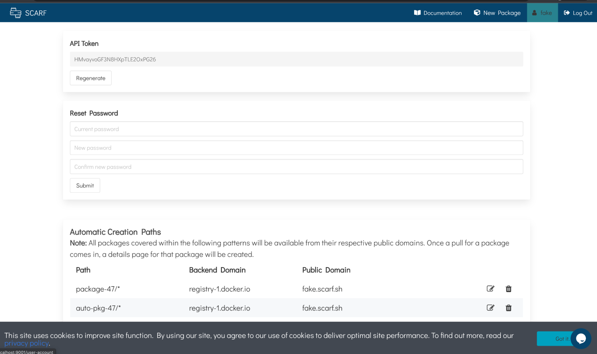
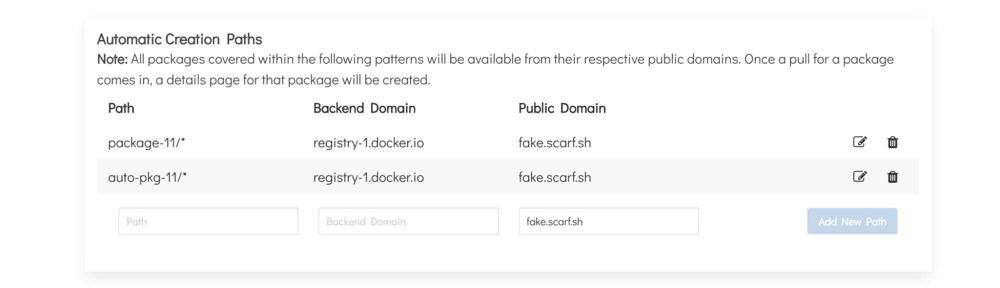

### Automatic Package Creation for Containers

Rather than creating packages entries for each container in your namespace, you can specify rules to automaically forward all matching traffic and create package entries automatically. By using a template, e.g. repository/*, every time an image matching that template is first downloaded, Scarf will automatically create a page for that package (e.g. repository/test01, repository/new-item).

### Creating an Auto Package Rule from Settings
To get started, navigate to your user-settings page.

Next, please navigate to the Automatic Creation Paths table. Here, you’ll find all your current templates- with the options to edit, delete, and create new rules.

To create a new rule, please first insert the template that will be used. It can be anything of the form: repository/*, repository/{ variable1, variable2 }, etc. Next, insert the backend domain, the domain where your images are hosted (e.g. registry-1.docker.io, ghcr.io, gcr.io). Please keep in mind, each public domain should map to one backend domain. (E.g. If you’re using your Scarf domain for your images hosted on docker, you will not be able to use your Scarf domain for your images hosted on Amazon.) Submit your new rule!

### Creating an Auto Package Rule for Your Organization

To begin, navigate to “Manage Organizations.”

Please select the organization you would like to add a template for.

In the Edit Organization Details page for that specific organization, you will find the Auto Creation Paths table at the very bottom.

From here, please first insert the template that will be used. It can be anything of the form: repository/*, repository/{ variable1, variable2 }, etc.

Next, insert the backend domain, the domain where your images are hosted (e.g. registry-1.docker.io, ghcr.io, gcr.io). Please keep in mind, each public domain should map to one backend domain. (E.g. If you’re using your Scarf domain for your images hosted on docker, you will not be able to use your Scarf domain for your images hosted on Amazon.)

Submit your new rule!

