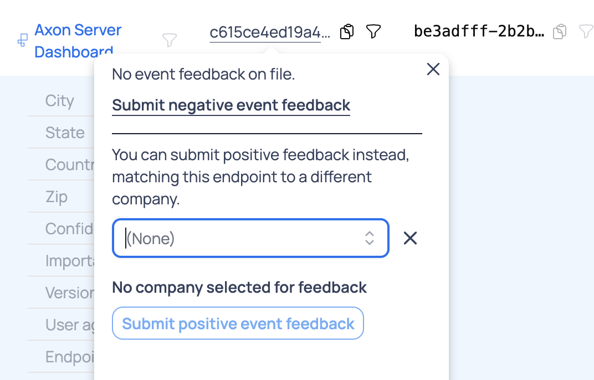

# How company matching works

Scarf uses network metadata to estimate which company generated a package download, documentation view, or other event. Company matching is probabilistic, so each match includes a confidence level rather than a guarantee.

## How Scarf creates a match

When Scarf receives an event:

1. Scarf asks several data providers for company information associated with the event's IP address.
2. Scarf compares the providers' results.
3. Scarf combines those results based on provider quality, agreement among providers, and match feedback from Scarf customers.
4. Scarf assigns the event a company match and confidence level when the available evidence supports one.

Agreement among independent providers strengthens a match. Conflicting or limited provider data lowers confidence. Feedback about correct and incorrect matches helps Scarf improve future results for the same network source.

## How to interpret confidence

Confidence describes the strength of the evidence behind a company match. It does not measure how interested the company is in your project or prove that the activity happened for work.

- **High confidence** means the available evidence strongly supports the match.
- **Medium confidence** means the evidence supports the match but leaves some uncertainty.
- **Low confidence** means the evidence is limited or conflicting. Treat these matches as leads for further review.

Review repeated activity over time before drawing conclusions from a company match. A single event may come from a shared network, VPN, cloud provider, or a developer using a corporate connection for a personal project.

## Why matches can be wrong or incomplete

IP addresses do not map cleanly to people or companies. Remote work, VPNs, mobile networks, shared offices, cloud infrastructure, and changes in IP ownership can obscure the organization behind an event.

Sometimes Scarf can identify only the network or hosting provider. In those cases, Scarf may show the provider, such as Amazon Web Services, instead of the company using that infrastructure.

## Correcting a match

Use match feedback when you know Scarf's company match is wrong or can identify the correct company from first-party context. Scarf uses your feedback when it categorizes future events.

Choose the scope that matches what you want to correct:

- **Company-wide feedback** changes the match for all activity currently assigned to the company.
- **Endpoint feedback** changes the match only for activity from one `endpoint_id`, which represents a network source.

### Correct the match for a company

Use company-wide feedback only when all activity on the company page belongs to the same corrected company.

1. Open **Insights > Companies** and find the company that Scarf matched incorrectly.
2. Click the company name to open its company details page.
3. At the top of the page, open the match-feedback control next to the company name.
4. Choose one of the following options:
    - Submit negative feedback to remove the company match.
    - Search for and select the correct company, then submit positive feedback to replace the match.

### Correct the match for one endpoint

Use endpoint feedback when only one network source on the company page belongs to a different company. This preserves the match for the company's other activity.

1. Open **Insights > Companies** and select the company that contains the incorrectly matched event.
2. Scroll to the event table on the company details page.
3. Find the event you want to correct. Use the event details and `endpoint_id` to confirm that you have the right network source.
4. In the `endpoint_id` column, click the feedback icon beside that endpoint.
5. Choose one of the following options:
    - Click **Submit negative event feedback** to stop matching that endpoint to the current company.
    - Search for and select the correct company, then click **Submit positive event feedback** to match that endpoint to the selected company.

Submit positive feedback when you have evidence that identifies the correct company, such as a known hostname, SSO domain, internal company URL pattern, or first-party customer data. A referrer or domain can identify a different company than Scarf's IP-based match because IP-to-company matching is probabilistic.

Negative endpoint feedback prevents that network source from matching the current company in future processing. For organizations on legacy Monthly Tracked Company plans, a company removed through negative feedback will not consume an MTC in the following month.

## Privacy

Scarf uses an event's IP address to look up company and location metadata, then discards the raw IP address. Scarf does not expose raw IP addresses in the dashboard or exports.

For more detail about the data Scarf collects, see the [FAQ](faq.md).
