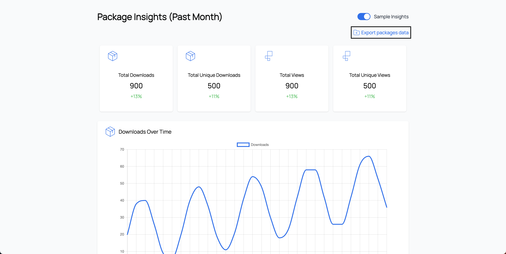

# Data Export

### How to Export Data from Scarf

To export data out of Scarf, go to the main dashboard and click "Export packages data".

The data you can export from Scarf includes all events (defined as package downloads and pixel views) from every user that has interacted with your Scarf-enabled artifacts (packages and pixels). Upon clicking "Export packages data", this data will download as a .csv file.

You can also export this data using [the Scarf API](/api-v2).

### Data Fields

The data export includes the following categories:

- **id**: This uniquely identifies the event (pixel view or package download) that occurred
- **type**: This categorizes the type of event that occurred (e.g. *pixel-fetch*, *manifest-fetch*, *binary-download*, etc.)
- **package**: For Scarf package downloads, this specifies which package has been downloaded
- **version**: For Scarf package downloads, this specifies which version of the package has been downloaded
- **time**: This refers to the time in UTC that the event occurred
- **referer**: For Scarf pixel views, this refers to the page that was viewed
- **user_agent**: This refers to the User-Agent, which provides information around the method of installation, often including information such as operating system, device, browser, architecture, and client
- **variables**: This refers to any custom-specified variables that you might use Scarf to track in [file package downloads](/packages/#files)
- **origin_id**: This uniquely identifies the user (through a specific device) who has interacted with a Scarf event
- **origin_latitude**: This is the latitude of the location Scarf is able to identify for the event
- **origin_longitude**: This is the longitude of the location Scarf is able to identify for the event
- **origin_country**: This is the country of the location Scarf is able to identify for the event
- **origin_city**: This is the city of the location Scarf is able to identify for the event
- **origin_postal**: This is the postal code (ZIP code, in the US) of the location Scarf is able to identify for the event
- **origin_connection_type**: This categorizes the type of IP address Scarf is able to identify (e.g. business, isp, hosting, etc.)
- **origin_company**: If Scarf is able to associate the event with a known business entity, that business entity is listed here
- **origin_domain**: If Scarf is able to associate the event with a known business entity, that business entity's web domain address is listed here
- **dnt**: If the user includes a DNT request in their header, that is logged here and [they will not be tracked](/gateway/#do-not-track)

### Integrations

Integrations are in development, if you have particular data sources you'd like Scarf to integrate with, we'd love to hear from you.

- Scarf to PostgreSQL - [https://github.com/scarf-sh/scarf-postgres-exporter](https://github.com/scarf-sh/scarf-postgres-exporter)

*Note*: Exporting data from Scarf will only work if you are on a [Scarf Professional Tier plan](https://about.scarf.sh/#pricing-section).
