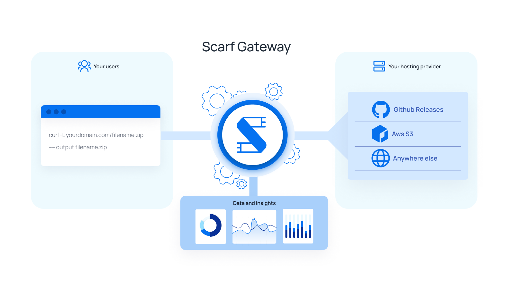
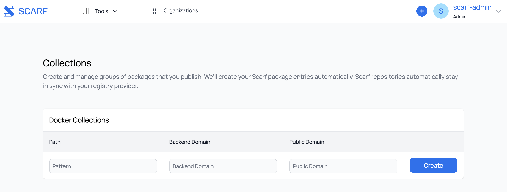

# Scarf Gateway

### Overview


Scarf Gateway is a service that sits in front of your existing software hosting platform(s), acting as a single access-point to all of your artifacts, regardless of where they are actually hosted. By making it easy to host content from your own domain, Scarf Gateway decouples your distribution from your hosting provider and provides in-depth download analytics.

Suppose you maintain a Docker container image `acme/rocket-skates` on Docker Hub. Your users would normally pull your container image from Docker hub directly (`docker pull acme/rocket-skates`.) Using Scarf, they would pull from Scarf Gateway using your private domain (`docker pull docker.acme.com/acme/rocket-skates`.) Important analytics are recorded and shared with you while you are using Scarf and you may change your hosting providers at any time without changing your container image name or documentation.

Your users will always be using your domain to pull your Docker container images. Your Docker container images can stay on their current hosting provider, but will be served through your own domain, e.g.:

```bash
# Make your existing container available through your own domain
$ docker pull docker.acme.com/acme/rocket-skates

# Scarf provides a domain too if you'd prefer to use ours
$ docker pull acme.docker.scarf.sh/acme/rocket-skates
```

Data insights about your Docker container image's downloads can be found in your Scarf Dashboard. From there, you can also manage Scarf Gateway configuration, access controls, and more.

### Configuring

#### Scarf Package Entries

Everything that is served and tracked via Scarf Gateway needs a corresponding _package_ entry on [scarf.sh](scarf.sh). Configuration, analytics, and permissions are all done at the level of a package, or single repository. `rocket-skates`, `acme/rocket-skates` are all valid package entries. Because packages can seamlessly change their hosting provider, hostnames (e.g. `gcr.io`) are not part of the package identifier on Scarf (e.g. `acme/rocket-skates` and not `gcr.io/acme/rocket-skates`.)

To create your package entry, click "New Package" in the navbar in your Scarf dashboard. Then select the corresponding package type for your artifact.

#### Container Image Packages


Scarf Gateway configuration for a Docker container image entry has two main considerations:

- **Backend URL**: This refers to where your container is actually hosted, the location where Scarf will direct requests to pull the container. Scarf will ask for your container's current pull command. This could be `rocket-skates`, `acme/rocket-skates` (implicitly specifying Docker Hub as the hosting provider, `registry-1.docker.io/acme/rocket-skates`), or a fully qualified container image name `docker.acme.come/acme/rocket-skates`. You can modify this backend URL attribute later, and your user's Docker pulls will be instantly moved over to the new destination without having to communicate anything to them.
- **Domain**: This can be your own domain, or a Scarf-supplied domain, of the form `<username>.docker.scarf.sh`. By default your Scarf domain will be used if this field is left empty. Note that this will be part of your Docker pull command for your users. While you can update this domain, updating your public domain is a breaking change for any users on the current domain! Edit this value with caution.

If you elect to use your own domain, you'll need to add a CNAME for that domain to `gateway.scarf.sh`. Additionally we require you to verify your ownership of the domain by setting a TXT with a value that Scarf provides upon package creation. See your DNS provider's instructions for how to add CNAME and TXT records.

See [Figure 0](#figure_0) to see how these pieces fit together visually.

#### Python Packages


Scarf Gateway configuration for a Python package entry has three main considerations:

- **pip Command**: This is the current pip command used to install your package. For packages on PyPI.org, this will be of the form `pip install my-pkg` and will include the `--extra-index-url https://my-python-project-domain.com` if your package is hosted elsewhere. This defines the location where the users will be redirected to when installing your package.
- **Domain**: This can be your own domain, or a Scarf-supplied domain, of the form `<username>.gateway.scarf.sh`. By default, your Scarf domain will be used if this field is left empty.

#### Installing Python packages via requirements.txt
Add the --extra-index-url option at the top of your requirements.txt:

```
--extra-index-url https://my-python-project-domain.com/simple/
my-pkg==0.0.1
```

NOTE: We have noticed indeterminate behavior in some versions of Pip that have resulted in the public registry being used for download regardless of the --extra-index-url addition.

If you elect to use your own domain, you'll need to add a CNAME for that domain to `gateway.scarf.sh`. Additionally we require you to verify your ownership of the domain by setting a TXT with a value that Scarf provides upon package creation. See your DNS provider's instructions for how to add CNAME and TXT records.

#### File Packages

File Packages on Scarf are a flexible and low-level package type that can track visits and downloads on arbitrary URLs. File packages were originally created to track published tar balls, but it has since expanded to many other use cases and will likely be renamed in future versions of Scarf. You can think of File Packages as a powerful and fully customizable link shortener. Common use cases include:

- Tracking downloads of GitHub release artifacts
- Tracking downloads of every artifact on your company/project "downloads" page
- Tracking downloads of Homebrew packages from a tap/formula that you control
- Sending custom telemetry or other events from your application
- Tracking and attributing visits to marketing and sales content on your site.



Scarf Gateway configuration for a file package entry has a few main considerations:

- **Domain**: Just like Docker container images, you may choose to use your own domain(s) for serving files. You may also choose to use `<username>.gateway.scarf.sh` provided by default by Scarf. Remember, if you elect to use your own domain, you'll need to add a CNAME for that domain to `gateway.scarf.sh` as well as verify ownership of that domain.
- **Incoming Path**: This refers to where a path on a given domain where Scarf will direct requests to fetch a file asset. This could be static path like `/downloads/rocket-skates.tar.gz` or a template path with variables like `/files/{version}/{platform}/rocket-skates-{platform}-{version}.tar.gz`. You may use variables in your incoming path as specified in [RFC 6570](https://datatracker.ietf.org/doc/html/rfc6570). You can modify a path value later, but be careful to communicate to your users because this would be a breaking change. Read more about [variables here](#variables).
- **Outgoing URL**: This is an *optional* full URL to your asset on your HTTP/S hosting provider. It is a template (or static) URL that may also use any variables defined in the Incoming Path. For example `https://besthostingprovider.com/acme/{platform}/rocket-skates-{version}.tar.gz`. If an Outgoing URL is not provided, the Gateway will return 200 with no redirect.
- **Catch-all redirects**: Select this option if you intend to configure a domain-level redirect with your File Package (ie, redirecting `site.com/*` -> `anothersite.com/*`).

See [Figure 3](#figure_3) to see how these pieces fit together visually.

#### Variables
<a id="variables"></a>

Scarf Gateway supports dynamic URL routing through the use of variables, enabling flexible and scalable management of downloads across various versions, platforms, and configurations.

Variables are any string denoted within curly braces `{}` or in the URL's query parameters and can be incorporated into the incoming-path and outgoing-url fields of your package configuration. For example:

```
"incoming-path": "/project/{platform}/{version}/file.tar.gz",
"outgoing-url": "https://example.com/downloads/{platform}/project-{version}.tar.gz"
```

In this configuration:

A request to `https://yourorg.gateway.scarf.sh/project/linux-arm64/1.2.3/file.tar.gz` would be redirected to `https://example.com/downloads/linux-arm64/project-1.2.3.tar.gz`, with `version = 1.2.3` and `platform = linux-arm64` stored.

Variables are parsed by in URLs by Scarf as defined by [RFC 6570](https://datatracker.ietf.org/doc/html/rfc6570). This means that variables can span multiple segments of a path with a `+` prefix, for instance:

```
"incoming-path": "/foo/{+path}",
"outgoing-url": "https://example.com/downloads/foo/{+path}"
```

would route `https://yourorg.gateway.scarf.sh/foo/a/b/c` to `https://example.com/downloads/foo/a/b/c` with `path = a/b/c`

Query parameters are also automatically interpreted as variables for analytics, though they do not affect gateway redirection behavior. The following would send `a=b` and `b=c`, regardless of any pre-configured variables in the URL template.

```
https://yourorg.gateway.scarf.sh/foo?a=b&b=c

```

Best Practices
- Route Structuring: Place fixed path segments before variables to ensure clear and unambiguous routing. For instance, prefer /project/{version}/file.tar.gz over /{project}/{version}/file.tar.gz.
- Version Management: Utilize variables like {version} to handle multiple versions without creating separate routes for each. This approach simplifies updates and maintenance.
- Platform Differentiation: Incorporate variables such as {os} or {arch} to manage platform-specific downloads efficiently.

Analytics Granularity: Variables enable detailed analytics in the Scarf dashboard, allowing you to track downloads per version, platform, or other defined segments.

#### Variable defaults and overrides

When Scarf processes events like a Docker download, it will automatically pull out special information like the system `platform` or the `version`/`tag`. The same applies for extracting the `page` when a user views a page with a Scarf pixel. These system-recognized variables are treated in specific ways by Scarf, unlike arbitrary variables which are custom-defined and have no special meaning to how Scarf processes your event data.

For lower-level package types like File Packages and Event Collection Packages, Scarf will look for system-recognized variables that can be populated by using specific variable names by default, or you can configure them directly by setting a [custom variable override](https://app.scarf.sh/organizations/default/filters).

| Default variable name | Usage and details                                                                                                                                                                                                                                                                                                           |
|-----------------------|-----------------------------------------------------------------------------------------------------------------------------------------------------------------------------------------------------------------------------------------------------------------------------------------------------------------------------|
| `page`                | The page that was viewed. By default, Scarf uses the `referer` header in the HTTP request. However, when rendered on sites like GitHub, sending up `page` explicitly is useful to work around this behavior.                                                                                                                |
| `platform`            | Platform of the client behind the download and event. Scarf has a known set of recognized platforms: <br>- `macos`<br>- `darwin`<br>- `linux`<br>- `windows`<br>- `ios`<br>- `android`<br>- `aix`<br>- `freebsd`<br>- `openbsd`<br>- `sunos`<br>- `unknownplatform`<br>- `allplatforms` |
| `version`             | The artifact/package version downloaded/used                                                                                                                                                                                                                                                                                |

#### Event Collection Packages

Event collection packages are a general package type for collecting telemetry from your code or processing bulk imports of events from an external source. They are equivalent to a `file package` without a redirect. Scarf will always respond with a 200 to denote the event was successfully stored, rather than a 302 like other package types.

If you have a specific schema of data you are expecting to send, you can still configure an incoming path pattern with variables in advance, or just use query parameters to dynamically send any fields you wish.

### How it works

When a user requests a Docker container image through Scarf, Scarf simply issues a redirect response, pointing to whichever hosting provider you've configured for your container. Certain container runtimes do not handle redirects appropriately during authentication (which is required even for anonymous pulls), and, in those cases, Scarf will proxy the request to the host instead of redirecting. For a visualization of the system from the end-user's perspective, see [Figure 1](#figure_1). For an overview of the entire system, [Figure 2](#figure_2).

When a user requests a file through Scarf, Scarf simply issues a redirect response, pointing to whichever hosting provider you've configured for your file. For a visualization of the system from the end-user's perspective, see [Figure 4](#figure_4). For an overview of the entire system, [Figure 5](#figure_5).

**Dashboard and Data Access**

Your package's usage data will be made available to you in your Scarf dashboard. You can grant others access to your package's usage data as well from your package details page. Current permission levels supported are:

| Access Level | Description                                                                                                                    |
| -----------  | -----------                                                                                                                    |
| Owner        | Can read all package-level data, edit package configuration, and grant access to other members                                 |
| Admin        | Can read all package-level data, edit package configuration, and grant access to other members (but can't remove other admins) |
| Member       | Can read all package-level data                                                                                                |

#### Docker Packages: Defining a container pull

Scarf defines a pull based on how [Docker Hub defines them](/docker-hub/download-rate-limit) for the purposes of their rate-limiting functionality.

A pull is defined as one or more `GET` requests on hosting provider manifest URLs (`/v2/*/manifests/*`). `HEAD` requests are not counted as a pull.

Note that even if a client downloads the blobs that comprise any given container, the container's manifest file may already be cached on the client, meaning the download would not be counted in Scarf's analytics. Future versions of Scarf's data processing pipelines will be more intelligent and will track things like partial downloads, blob fetches, etc.

#### Security

All interactions through Scarf Gateway occur over HTTPS. Scarf Gateway will procure a valid TLS certificate via [LetsEncrypt](https://letsencrypt.org), and perform TLS termination for the traffic. Scarf Gateway in turn will issue a redirect for the request, or proxy the request to the hosting provider.

#### Do Not Track

Our gateway respects the HTTP Headers as defined in [DNT](https://www.w3.org/2011/tracking-protection/drafts/tracking-dnt.html) and [GPC](https://developer.mozilla.org/en-US/docs/Web/HTTP/Headers/Sec-GPC). If you send an HTTP request to our Scarf Gateway with the HTTP header "DNT=1" or "Sec-GPC=1", we will not count your request in our statistics nor will we lookup your IP address to determine if you are a business. Basically, it will be as if you didn't request anything from our gateway but we will still serve the content to you.

Please note that this behavior works for all packages and pixels that are served through our gateway. If users have DNT turned on in their browser settings, we will not track file downloads or pixel views.

### Availability

Scarf Gateway is a free hosted service that is publicly provided as-is and as-available.

Scarf Gateway is deployed on AWS in multiple regions around the globe; it is fault tolerant even to entire regions going offline, and can automatically scale our backend capacity to meet whatever user traffic demands of us.

We aim for a monthly service uptime percentage of 99.9%. If you need uptime and/or support SLAs to guarantee that uptime for your company, please contact [sales@scarf.sh](mailto:sales@scarf.sh)

To see Scarf's historical uptime and system status, you can view the status page [here](https://status.scarf.sh).

### Badges

All packages on Scarf Gateway offer dynamic Scarf-powered README badges automatically. Head to your package page, and the badges will be shown in the details section near the top. Copy the URL, paste it into your project’s README based on whatever doc format you are using and you’re all set.


**What is the difference between the downloads badge and the company badge?**

The *commercial usage* badge shows how many distinct companies have been identified to be fetching your Scarf Gateway package in the previous month. The *downloads* badge reports the total number of downloads across all users.

**What is the purpose of this badge?**

README badges let you show off your project by sharing high-level real-time data about your download traffic and commercial adoption, so readers can quickly assess some basic details about your project. Scarf-powered README badges are an easy way to share your project’s usage data publicly, regardless of where on the internet your docs are being rendered. Telling prospective new users how many companies use your project is a great way to show that your project is reliable and worth adopting.

**What is the URL format of the badges**

The badges can be used in the following formats:

- Company Badge
    - https://scarf.sh/package/company-badge/{package-id}
    - https://scarf.sh/company-badge/{username}/{package-name}?package-type={package-type}

- Downloads Badge
    - https://scarf.sh/package/installs-badge/{package-id}
    - https://scarf.sh/installs-badge/{username}/{package-name}?package-type={package-type}

You can also pass some additional settings to your badges via query strings: `color`, `label-color`, `logo`, `logo-color` and `style`. For example, `https://scarf.sh/package/installs-badge/{package-id}?color=red&style=flat`. See https://shields.io/#colors to know more about the supported values for each setting.

### <a name="caveats"></a>Caveats and Limitations

**A given subdomain can only point to a single container registry at a time.**

If you have Docker container images on multiple distinct registries, you'll currently need to use multiple distinct subdomains (one per hosting provider). This limitation is due to the current implementation of the Docker registry authorization. To begin pulling a container, an authentication request is sent, which must be passed to the hosting provider you configure Scarf Gateway to use. Unfortunately, the initial authorization request doesn't include any information about what image it's trying to pull all Scarf Gateway has to go on is the hostname used to begin to pull the Docker container image. Subsequent Docker API requests do the actual "pulling" of an image. The core of the problem is that, if you attempt to authorize with one registry and pull an image from another, it will fail with an authorization error.

**The path used in your container's new pull command must match the path on the backend container registry**

If your container is on Docker Hub as `acme/rocket-skates`, your install command must be: `docker pull ~<your-domain.com>/acme/rocket-skates`. The image name path (acme/rocket-status) is not something that can be changed at this time. This is due to the Docker client's OAuth implementation (authorization includes the image name path of the being requested.) If Scarf Gateway redirects to a different path, the authorization becomes invalid and the Docker pull will fail.

#### Automatic Package Creation for Containers

Rather than creating packages entries for each container in your namespace, you can specify rules to automatically forward all matching traffic and create package entries automatically. By using a template, e.g. ``repository/*``, every time an image matching that template is first downloaded, Scarf will automatically create a page for that package (e.g. repository/test01, repository/new-item).

### Creating Collections
To acces Collections, in the top menu click `Tools` > `Collections`.


You will now be presented with the `Collections` page that give you the options to edit, delete, and create new collections.



To create a new collection, please first insert the template that will be used. It can be anything of the form: ``repository/*``, ``repository/{ variable1, variable2 }``, etc. Next, insert the backend domain, the domain where your images are hosted (e.g. registry-1.docker.io, ghcr.io, gcr.io). Please keep in mind, each public domain should map to one backend domain. (E.g. If you’re using your Scarf domain for your images hosted on docker, you will not be able to use your Scarf domain for your images hosted on Amazon.) Submit your new rule!

## FAQ

For common questions about Scarf Gateway (and the rest of the platform), see the consolidated [FAQ](faq.md).

## Figures

<a id="figure_0"></a>

#### Figure 0: Using Scarf (Docker) Gateway as a maintainer


<a id="figure_1"></a>

#### Figure 1: Pulling a Docker container image from Scarf (Docker) Gateway as a User


<a id="figure_2"></a>

#### Figure 2: Full System Diagram (Docker)


<a id="figure_3"></a>

#### Figure 3: Using Scarf (File) Gateway as a maintainer


<a id="figure_4"></a>

#### Figure 4: Downloading a File from Scarf (File) Gateway as a User


<a id="figure_5"></a>

#### Figure 5: Full System Diagram (File)


