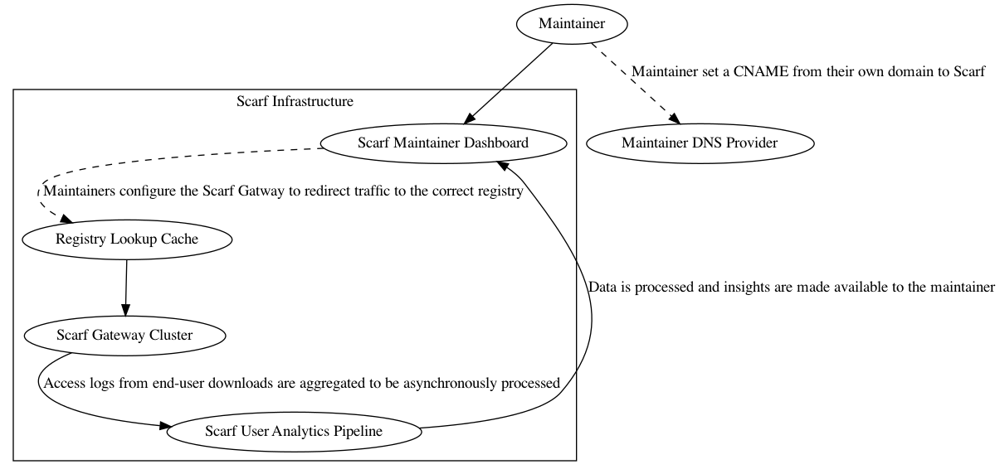
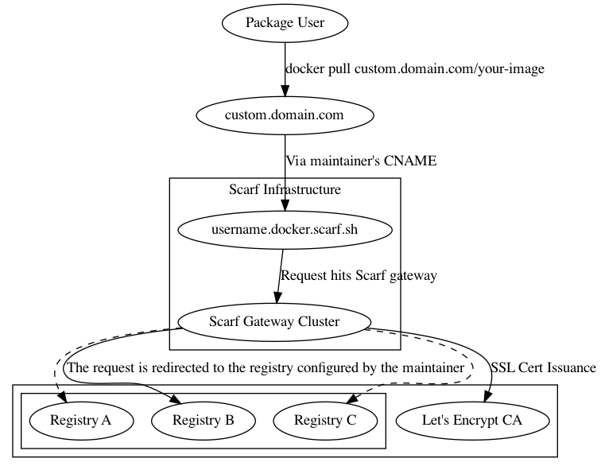
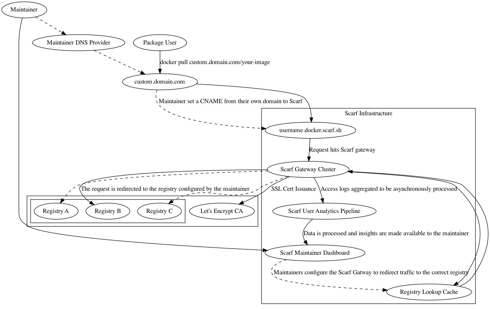

### Overview


The Scarf Gateway is a service that sits in front of your container registry/registries, acting as a single access-point to all of your containers, regardless of where they are actually hosted. By making it easy to host containers from your own domain, the gateway decouples your distribution from your registry provider and provides in-depth download analytics.

Suppose you maintain a container `your-org/a-container-name`. Your users pull your container via `docker pull your-org/a-container-name` (or an alternative container runtime command). Scarf provides a thin redirect layer in front of your registry so that you can offer a registry-independent route to your container, on your own domain.

With Scarf, your container can stay on its current registry, but be served through your own domain, e.g.:

```bash
# Make your existing container available through your own domain
$ docker pull registry.custom.com/your-org/a-container-name

# Scarf provides a URL too if you'd prefer
$ docker pull org.docker.scarf.sh/your-org/a-container-name
```

Data insights about your container's downloads can be found in your Scarf dashboard. From there, you can also manage your gateway configuration, access controls, and more.

### Configuring

**Packages**

Every container served through the Scarf Gateway needs a corresponding _package_ entry on [scarf.sh](scarf.sh). Configuration, analytics, and permissions are all done at the level of a package, or single repository. `hello-world`, `myorg/image` are all valid package entries. Because packages can seamlessly change their registry, hostnames (e.g. `gcr.io`) are not part of the package identifier, i.e. `myorg/image` and not `gcr.io/myorg/image`. 

To create your package entry, click "New Package" in the navbar in your Scarf dashboard, or [click here](https://scarf.sh/create-package). 

**Configuring a container on the Scarf Gateway**

Gateway configuration for a package entry has two main considerations:

- **Backend URL**: This refers to where your container is actually hosted, the location where Scarf will direct requests to pull the container. Scarf will ask for your container's current pull command. This could be `hello-world`, `org/name` (implicitly specifying Docker Hub as the registry, `registry.hub.docker.com/org/name`), or a fully qualified `ghcr.io/namespace/imagename`. You can modify this value later, and your traffic will be instantly moved over to the new destination.
- **Public domain**: This will represent your new pull command through Scarf. This can be your own domain, or a Scarf-supplied domain, of the form `<username>.docker.scarf.sh`. While you can update this value, updating your public domain is a breaking change for any users on the current domain! Edit this value with caution.

If you configure your public domain to be a custom domain, you'll need to add a CNAME to `<username>.docker.scarf.sh`. See your DNS provider's instructions for how to do this.

See [Figure 0](#figure_0) to see how these pieces fit together visually.

### How does it work?

When a user requests a container through Scarf, Scarf simply issues a redirect response, pointing to whichever registry host you've configured for your container. Certain container runtimes do not handle redirects appropriately during registry authentication (which is required even for anonymous pulls), and in those cases Scarf will proxy the request to the host instead of redirecting. For a visualization of the system from the end-user's perspective, see [Figure 1](#figure_1). For an overview of the entire system, [Figure 2](#figure_2).

**Dashboard and Data Access**

Your container's usage data will be made available to you in your Scarf dashboard. The data insights are private by default, but you can grant others access as well from your package details page. Current permission levels supported are:

| Access Level | Description                                                                                    |
| -----------  | -----------                                                                                    |
| Admin        | Can read all package-level data, edit package configuration, and grant access to other members |
| Member       | Can read all package-level data                                                                |

Scarf does not yet support organization-level permissions but will soon.

### Defining a container pull

Scarf defines a pull based on how [Docker Hub defines them](https://docs.docker.com/docker-hub/download-rate-limit/) for the purposes of their rate-limiting functionality.

A pull is defined as one or more `GET` requests on registry manifest URLs (`/v2/*/manifests/*`). `HEAD` requests are not counted as a pull.

Note that even if a client downloads the blobs that comprise any given container, the container's manifest file may already be cached on the client, meaning the download would not be counted in Scarf's analytics. Future versions of Scarf's data processing pipelines will be more intelligent and will track things like partial downloads, blob fetches, etc.


### Security

All pulls through the gateway occur over HTTPS. If you configure Scarf to host your container via a custom domain, Scarf will fetch an issued SSL certificate via [LetsEncrypt](https://letsencrypt.org), and perform SSL termination for the traffic. The gateway in turn will issue a redirect for the request, or proxy the request to the backend registry.

### Availability

The Scarf Gateway is a free hosted service that is provided to maintainers and users as-is and as-available. It is currently in an open beta stage that is available to anyone.

Scarf is deployed on AWS in multiple regions around the globe; it is fault tolerant even to entire regions going offline, and can automatically and elasticly scale our backend capacity to meet whatever user traffic demands of us. 

We are expecting to meet a monthly service uptime percentage of 99.9%. Guarantees of our service-level agreement will be made available in the future, when the system moves from beta to general availability.


To see Scarf's uptime and system status, you can view the status page [here](https://status.scarf.sh).

### Badges

All packages on the Scarf Gateway offer dynamic Scarf-powered README badges automatically. Head to your package page, and the badges will be shown in the details section near the top. Copy the URL, paste it into your project’s README based on whatever doc format you are using and you’re all set.

  


**What is the difference between the downloads badge and the company badge?**

The *commercial usage* badge shows how many distinct companies have been identified to be fetching your gateway package in the previous month. The *downloads* badge reports the total number of downloads across all users.

**What is the purpose of this badge?**

README badges let you show off your project by sharing high-level real-time data about your download traffic and commercial adoption, so readers can quickly assess some basic details about your project. Scarf-powered README badges are an easy way to share your project’s usage data publicly, regardless of where on the internet your docs are being rendered. Telling prospective new users how many companies use your project is a great way to show that your project is reliable and worth adopting.


### <a name="caveats"></a>Caveats and Limitations

**A given subdomain can only point to a single container registry at a time.**

If you have containers on multiple distinct registries, you'll currently need to point users to distinct subdomains. This limitation is due to the current implementation of the `docker` client. To begin pulling a container, initialization and authentication requests are sent, which must be passed to the backend registry you configure the Scarf Gateway to use. Unfortunately, these requests don't include any information about what image it's trying to pull, so at the time of these requests, all Scarf has to go on is the hostname used to access the image. This is a limitation we are working to fix.  


**The path used in your container's new pull command must match the path on the backend container registry**

If your container is on Docker Hub as `mynamespace/myimage`, your install command must be:  
`docker pull ~<your-domain.com>/mynamespace/myimage`. The install path through Scarf is not something that can be changed at this time. This is also due to the Docker client's current implementation. Request signatures include the path of the image being requested. If the Scarf Gateway redirects to a different path, the signature becomes invalid and the request will fail. This is a limitation we are working to fix.  

## FAQ

**How do I get started using the Gateway?**

First, create an account on Scarf, if you haven’t already done so. 
Once you’ve registered, you’ll be prompted to create a new package. If you’re already using Scarf, you’ll be able to click “New Package” in the navigation bar.

Select “Docker” for your package type and enter in the requested details about your container.
The Scarf Gateway currently supports Docker containers. Support for more package and artifact types are on the way. Stay tuned. 


**If I use a custom domain to host my container through Scarf, what happens to my existing users? Do they all have to update?**

Hosting containers on your custom domain via Scarf has no impact on your existing users; your domain adds a new path for users to download your package. You can encourage end-users to switch their pull commands over to your new domain, but they can continue pulling directly from your registry provider with no negative impact. 

Should you decide to switch registries later on, current users will have to update their pull commands to either your custom domain or to the new registry URL. If they go straight to the registry, they would need to update every time you decide to switch registries. If they use your custom domain, they will never need to update it again.

**Are you actually hosting my packages?**

No, your container continues to be hosted on your current registry not on Scarf itself. The Gateway is simply a thin redirect layer in front of your registry. Since the gateway acts as a static entry point to your containers, you will always have the freedom to host your container on any registry you choose. 

**My container's name on my current registry is `organization-name/project-name`, can I change that to just `project-name` when users pull through Scarf?**

Unforunately this is not possible unless you can change this name on the registry that hosts your container. Your container name on Scarf must match the container name on the registry that hosts it, because the Docker client uses that name to sign the request and validate the response from the registry. The Docker client will reject the download if the response signature is invalid. See the [Caveats section](#caveats) for more information.

**How are you managing the usage data you get about my project? Are you storing my users’ data?**

The Scarf Gateway does not store any personally identifying information or sensitive data about your users.

Scarf looks up IP address metadata, but the raw IP addresses are discarded and never exposed. IP metadata may contain:

  - Coarse-grained location
  - Device/OS information
  - Company information, cloud providers, etc. 
  - Additionally, Scarf sees metadata about the containers that are being downloaded such as:
  - Tags/versions
  - Client container runtime and version

**What package types are you planning to support next?**

We’d love your input to help us prioritize support for additional package types. Java, Python, and others are planned. The Gateway will ultimately be generalized to support arbitrary artifact types.

**How much does it cost to use the Scarf Gateway?**

The Scarf Gateway’s current feature set is free and will remain free. We will be adding additional functionality, features, service level agreements, and more, some free and some paid.

**Is the Scarf Gateway self-hosted or managed by Scarf?**

The Scarf Gateway is managed by the Scarf team. We plan an open source release of the Gateway for self-hosting, when it is out of the current open beta period and into general availability. 

**How long will it take for any given container download to show up in my analytics dashboard?**

Downloads will typically show up in your dashboard within 30 minutes.

**Is there an API I can use to pull my stats, manage my containers, etc?**

Yes! See [our API documentation](/api) for more information.

<a id="figure_0"></a>

## Figure 0: Using the Scarf Gateway as a maintainer

  


<a id="figure_1"></a>

## Figure 1: Pulling an image from the Scarf Gateway as an end-user

  


<a id="figure_2"></a>

## Figure 2: Full System Diagram

  

