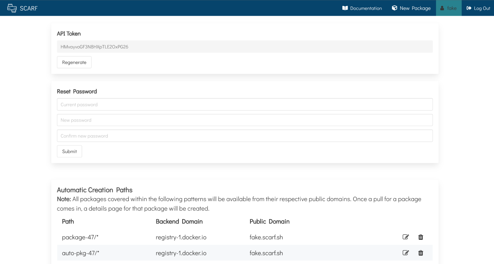
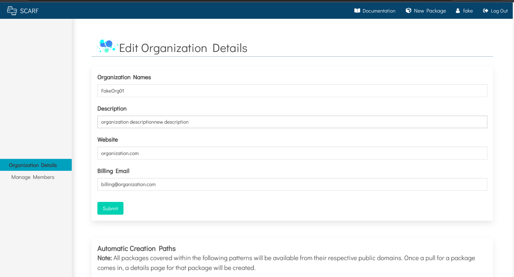
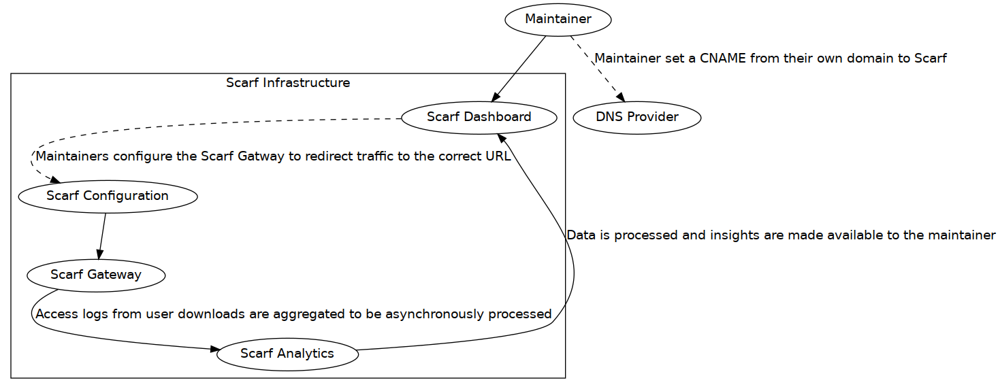
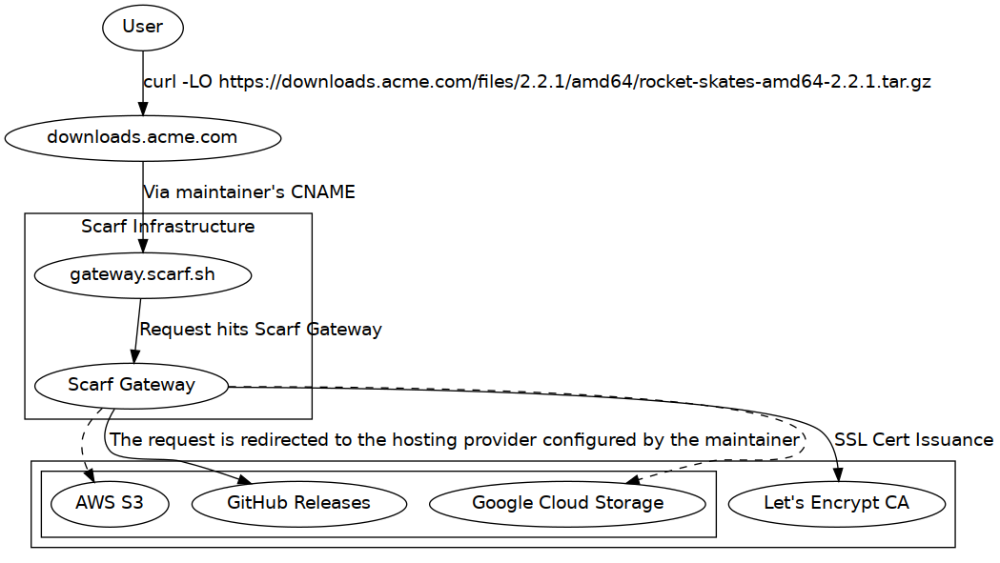

### Overview


Scarf Gateway is a service that sits in front of your existing software hosting platform(s), acting as a single access-point to all of your artifacts, regardless of where they are actually hosted. By making it easy to host content from your own domain, Scarf Gateway decouples your distribution from your hosting provider and provides in-depth download analytics.

Suppose you maintain a Docker container image `acme/rocket-skates` on Docker Hub. Your users would normally pull your container image from Docker hub directly (`docker pull acme/rocket-skates`.) Using Scarf, they would pull from Scarf Gateway using your private domain (`docker pull docker.acme.com/acme/rocket-skates`.) Important analytics are recorded and shared with you while you are using Scarf and you may change your hosting providers at any time without changing your container image name or documentation.

Your users will always be using your domain to pull your Docker container images. Your Docker container images can stay on their current hosting provider, but will be served through your own domain, e.g.:

```bash
# Make your existing container available through your own domain
$ docker pull docker.acme.com/acme/rocket-skates

# Scarf provides a domain too if you'd prefer to use ours
$ docker pull acme.docker.scarf.sh/acme/rocket-skates
```

Data insights about your Docker container image's downloads can be found in your Scarf Dashboard. From there, you can also manage Scarf Gateway configuration, access controls, and more.

### Configuring

#### Scarf Package Entries

Everything that is served and tracked via Scarf Gateway needs a corresponding _package_ entry on [scarf.sh](scarf.sh). Configuration, analytics, and permissions are all done at the level of a package, or single repository. `rocket-skates`, `acme/rocket-skates` are all valid package entries. Because packages can seamlessly change their hosting provider, hostnames (e.g. `gcr.io`) are not part of the package identifier on Scarf (e.g. `acme/rocket-skates` and not `gcr.io/acme/rocket-skates`.)

To create your package entry, click "New Package" in the navbar in your Scarf dashboard, or [click here](https://scarf.sh/create-package). Then select the corresponding package type for your artifact.

#### Container Image Packages


Scarf Gateway configuration for a Docker container image entry has two main considerations:

- **Backend URL**: This refers to where your container is actually hosted, the location where Scarf will direct requests to pull the container. Scarf will ask for your container's current pull command. This could be `rocket-skates`, `acme/rocket-skates` (implicitly specifying Docker Hub as the hosting provider, `registry-1.docker.io/acme/rocket-skates`), or a fully qualified container image name `docker.acme.come/acme/rocket-skates`. You can modify this backend URL attribute later, and your user's Docker pulls will be instantly moved over to the new destination without having to communicate anything to them.
- **Domain**: This can be your own domain, or a Scarf-supplied domain, of the form `<username>.docker.scarf.sh`. By default your Scarf domain will be used if this field is left empty. Note that this will be part of your Docker pull command for your users. While you can update this domain, updating your public domain is a breaking change for any users on the current domain! Edit this value with caution.

If you elect to use your own domain, you'll need to add a CNAME for that domain to `gateway.scarf.sh`. See your DNS provider's instructions for how to add a CNAME.

See [Figure 0](#figure_0) to see how these pieces fit together visually.

#### File Packages


Scarf Gateway configuration for a file package entry has three main considerations:

- **Domain**: Just like Docker container images, you may choose to use your own domain(s) for serving files. You may also choose to use `<username>.gateway.scarf.sh` provided by default by Scarf. Remember, if you elect to use your own domain, you'll need to add a CNAME for that domain to `gateway.scarf.sh`
- **Incoming Path**: This refers to where a path on a given domain where Scarf will direct requests to fetch a file asset. This could be static path like `/downloads/rocket-skates.tar.gz` or a template path with variables like `/files/{version}/{platform}/rocket-skates-{platform}-{version}.tar.gz`. You may use variables in your incoming path as specified in [RFC 6570](https://datatracker.ietf.org/doc/html/rfc6570). You can modify a path value later, but be careful to communicate to your users because this would be a breaking change.
- **Outgoing URL**: This is the full URL to your asset on your HTTP/S hosting provider. It is a template (or static) URL that may also use any variables defined in the Incoming Path. For example `https://besthostingprovider.com/acme/{platform}/rocket-skates-{version}.tar.gz`

See [Figure 3](#figure_3) to see how these pieces fit together visually.

#### Python Packages


Scarf Gateway configuration for a Python package entry has three main considerations:

- **pip Command**: This is the current pip command used to install your package. For packages on PyPI.org, this will be of the form `pip install my-pkg` and will include the `--extra-index-url https://my-python-project-domain.com` if your package is hosted elsewhere. This defines the location where the users will be redirected to when installing your package.
- **Domain**: This can be your own domain, or a Scarf-supplied domain, of the form `<username>.gateway.scarf.sh`. By default, your Scarf domain will be used if this field is left empty.

#### Installing Python packages via requirements.txt
Add the --extra-index-url option at the top of your requirements.txt:

```
--extra-index-url https://my-python-project-domain.com/simple/
my-pkg==0.0.1
```

NOTE: We have noticed indeterminate behavior in some versions of Pip that have resulted in the public registry being used for download regardless of the --extra-index-url addition. This is a client-specific problem and we are investigating.

If you elect to use your own domain, you'll need to add a CNAME for that domain to `gateway.scarf.sh`. See your DNS provider's instructions for how to add a CNAME.

### How it works

When a user requests a Docker container image through Scarf, Scarf simply issues a redirect response, pointing to whichever hosting provider you've configured for your container. Certain container runtimes do not handle redirects appropriately during authentication (which is required even for anonymous pulls), and, in those cases, Scarf will proxy the request to the host instead of redirecting. For a visualization of the system from the end-user's perspective, see [Figure 1](#figure_1). For an overview of the entire system, [Figure 2](#figure_2).

When a user requests a file through Scarf, Scarf simply issues a redirect response, pointing to whichever hosting provider you've configured for your file. For a visualization of the system from the end-user's perspective, see [Figure 4](#figure_4). For an overview of the entire system, [Figure 5](#figure_5).

**Dashboard and Data Access**

Your package's usage data will be made available to you in your Scarf dashboard. You can grant others access to your package's usage data as well from your package details page. Current permission levels supported are:

| Access Level | Description                                                                                                                    |
| -----------  | -----------                                                                                                                    |
| Owner        | Can read all package-level data, edit package configuration, and grant access to other members                                 |
| Admin        | Can read all package-level data, edit package configuration, and grant access to other members (but can't remove other admins) |
| Member       | Can read all package-level data                                                                                                |

Scarf does not yet support organization-level permissions but will soon.

#### Docker Packages: Defining a container pull

Scarf defines a pull based on how [Docker Hub defines them](https://docs.docker.com/docker-hub/download-rate-limit/) for the purposes of their rate-limiting functionality.

A pull is defined as one or more `GET` requests on hosting provider manifest URLs (`/v2/*/manifests/*`). `HEAD` requests are not counted as a pull.

Note that even if a client downloads the blobs that comprise any given container, the container's manifest file may already be cached on the client, meaning the download would not be counted in Scarf's analytics. Future versions of Scarf's data processing pipelines will be more intelligent and will track things like partial downloads, blob fetches, etc.

#### Security

All interactions through Scarf Gateway occur over HTTPS. Scarf Gateway will procure a valid TLS certificate via [LetsEncrypt](https://letsencrypt.org), and perform TLS termination for the traffic. Scarf Gateway in turn will issue a redirect for the request, or proxy the request to the hosting provider.

### Availability

Scarf Gateway is a free hosted service that is provided to maintainers and users as-is and as-available.

Scarf Gateway is deployed on AWS in multiple regions around the globe; it is fault tolerant even to entire regions going offline, and can automatically and elasticly scale our backend capacity to meet whatever user traffic demands of us.

We are expecting to meet a monthly service uptime percentage of 99.9%. Guarantees of our service-level agreement will be made available in the future.

To see Scarf's uptime and system status, you can view the status page [here](https://status.scarf.sh).

### Badges

All packages on Scarf Gateway offer dynamic Scarf-powered README badges automatically. Head to your package page, and the badges will be shown in the details section near the top. Copy the URL, paste it into your project’s README based on whatever doc format you are using and you’re all set.


**What is the difference between the downloads badge and the company badge?**

The *commercial usage* badge shows how many distinct companies have been identified to be fetching your Scarf Gateway package in the previous month. The *downloads* badge reports the total number of downloads across all users.

**What is the purpose of this badge?**

README badges let you show off your project by sharing high-level real-time data about your download traffic and commercial adoption, so readers can quickly assess some basic details about your project. Scarf-powered README badges are an easy way to share your project’s usage data publicly, regardless of where on the internet your docs are being rendered. Telling prospective new users how many companies use your project is a great way to show that your project is reliable and worth adopting.

**What is the URL format of the badges**

The badges can be used in the following formats:

- Company Badge
    - https://scarf.sh/package/company-badge/{package-id}
    - https://scarf.sh/company-badge/{username}/{package-name}?package-type={package-type}

- Downloads Badge
    - https://scarf.sh/package/installs-badge/{package-id}
    - https://scarf.sh/installs-badge/{username}/{package-name}?package-type={package-type}

You can also pass some additional settings to your badges via query strings: `color`, `label-color`, `logo`, `logo-color` and `style`. For example, `https://scarf.sh/package/installs-badge/{package-id}?color=red&style=flat`. See https://shields.io/#colors to know more about the supported values for each setting.

### <a name="caveats"></a>Caveats and Limitations

**A given subdomain can only point to a single container registry at a time.**

If you have Docker container images on multiple distinct registries, you'll currently need to use multiple distinct subdomains (one per hosting provider). This limitation is due to the current implementation of the Docker registry authorization. To begin pulling a container, an authentication request is sent, which must be passed to the hosting provider you configure Scarf Gateway to use. Unfortunately, the initial authorization request doesn't include any information about what image it's trying to pull all Scarf Gateway has to go on is the hostname used to begin to pull the Docker container image. Subsequent Docker API requests do the actual "pulling" of an image. The core of the problem is that, if you attempt to authorize with one registry and pull an image from another, it will fail with an authorization error.

**The path used in your container's new pull command must match the path on the backend container registry**

If your container is on Docker Hub as `acme/rocket-skates`, your install command must be: `docker pull ~<your-domain.com>/acme/rocket-skates`. The image name path (acme/rocket-status) is not something that can be changed at this time. This is due to the Docker client's OAuth implementation (authorization includes the image name path of the being requested.) If Scarf Gateway redirects to a different path, the authorization becomes invalid and the Docker pull will fail.

#### Automatic Package Creation for Containers

Rather than creating packages entries for each container in your namespace, you can specify rules to automaically forward all matching traffic and create package entries automatically. By using a template, e.g. ``repository/*``, every time an image matching that template is first downloaded, Scarf will automatically create a page for that package (e.g. repository/test01, repository/new-item).

### Creating an Auto Package Rule from Settings
To get started, navigate to your user-settings page.



Next, please navigate to the Automatic Creation Paths table. Here, you’ll find all your current templates- with the options to edit, delete, and create new rules.


To create a new rule, please first insert the template that will be used. It can be anything of the form: ``repository/*``, ``repository/{ variable1, variable2 }``, etc. Next, insert the backend domain, the domain where your images are hosted (e.g. registry-1.docker.io, ghcr.io, gcr.io). Please keep in mind, each public domain should map to one backend domain. (E.g. If you’re using your Scarf domain for your images hosted on docker, you will not be able to use your Scarf domain for your images hosted on Amazon.) Submit your new rule!


### Creating an Auto Package Rule for Your Organization

To begin, navigate to “Manage Organizations.”


Please select the organization you would like to add a template for.

In the Edit Organization Details page for that specific organization, you will find the Auto Creation Paths table at the very bottom.



From here, please first insert the template that will be used. It can be anything of the form: ``repository/*``, ``repository/{ variable1, variable2 }``, etc.

Next, insert the backend domain, the domain where your images are hosted (e.g. registry-1.docker.io, ghcr.io, gcr.io). Please keep in mind, each public domain should map to one backend domain. (E.g. If you’re using your Scarf domain for your images hosted on docker, you will not be able to use your Scarf domain for your images hosted on Amazon.)

Submit your new rule!


## FAQ

**How do I get started using Scarf Gateway?**

First, create an account on Scarf, if you haven’t already done so.
Once you’ve registered, you’ll be prompted to create a new package. If you’re already using Scarf, you’ll be able to click “New Package” in the navigation bar.

Select “Docker” for your package type and enter in the requested details about your container.
Scarf Gateway currently supports Docker containers. Support for more package and artifact types are on the way. Stay tuned.

**If I use a custom domain to host my container through Scarf, what happens to my existing users? Do they all have to update?**

Hosting containers on your custom domain via Scarf has no impact on your existing users; your domain adds a new path for users to download your package. You can encourage end-users to switch their pull commands over to your new domain, but they can continue pulling directly from your registry provider with no negative impact.

Should you decide to switch registries later on, current users will have to update their pull commands to either your custom domain or to the new registry URL. If they go straight to the registry, they would need to update every time you decide to switch registries. If they use your custom domain, they will never need to update it again.

**Are you actually hosting my packages?**

No, your package continues to be hosted on your current hosting provider not on Scarf itself. Scarf Gateway is simply a thin redirect layer in front of your provider. Since Scarf Gateway acts as a stable location on the internet for your packages, you will always have the freedom to host them with any provider you choose.

**My Docker container image name on my current registry is `acme/rocket-skates`, can I change that to just `rocket-skates` when users pull through Scarf?**

Unfortunately this is not possible unless you can change this name on the registry that hosts your container. Your container name on Scarf must match the container name on the registry that hosts it, because the Docker client uses that name to sign the request and validate the response from the registry. The Docker client will reject the download if the response signature is invalid. See the [Caveats section](#caveats) for more information.

**How are you managing the usage data you get about my project? Are you storing my users’ data?**

Scarf Gateway does not store any personally identifying information or sensitive data about your users.

Scarf looks up IP address metadata, but the raw IP addresses are discarded and never exposed. IP metadata may contain:

  - Coarse-grained location
  - Device/OS information
  - Company information, cloud providers, etc.
  - Additionally, Scarf sees metadata about the containers that are being downloaded such as:
  - Tags/versions (variables)
  - Client runtime and version

**What package types are you planning to support next?**

We’d love your input to help us prioritize support for additional package types. Java, RPM and others are planned. Scarf Gateway will ultimately be generalized to support arbitrary artifact types.

**How much does it cost to use Scarf Gateway?**

Scarf Gateway’s current feature set is free and will remain free. We will be adding additional functionality, features, service level agreements, and more, some free and some paid.

**Is Scarf Gateway self-hosted or managed by Scarf?**

Scarf Gateway is managed by the Scarf team. We plan an open source release of Scarf Gateway for self-hosting, when it is out of the current open beta period and into general availability.

**How long will it take for any given container download to show up in my analytics dashboard?**

Downloads will typically show up in your dashboard within minutes.

**Is there an API I can use to pull my stats, manage my packages, etc?**

Yes! See [our API documentation](/api) for more information.

**I have more questions, where is the best place to ask?**

[Join us in Slack](https://tinyurl.com/scarf-community-slack), we're more than happy to help.

## Figures

<a id="figure_0"></a>

#### Figure 0: Using Scarf (Docker) Gateway as a maintainer


<a id="figure_1"></a>

#### Figure 1: Pulling a Docker container image from Scarf (Docker) Gateway as a User


<a id="figure_2"></a>

#### Figure 2: Full System Diagram (Docker)


<a id="figure_3"></a>

#### Figure 3: Using Scarf (File) Gateway as a maintainer



<a id="figure_4"></a>

#### Figure 4: Downloading a File from Scarf (File) Gateway as a User



<a id="figure_5"></a>

#### Figure 5: Full System Diagram (File)


