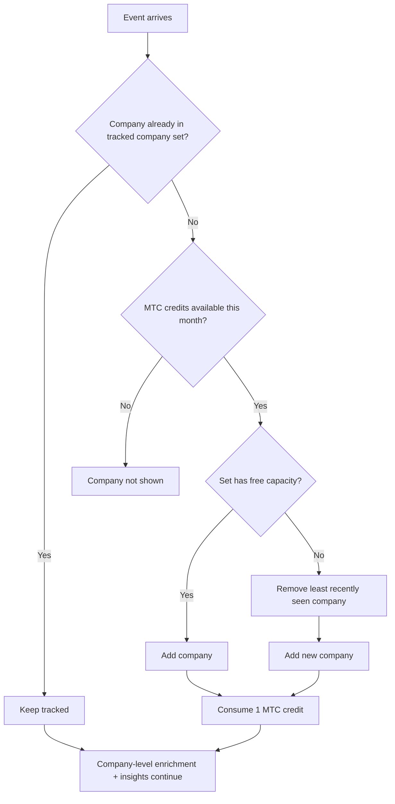
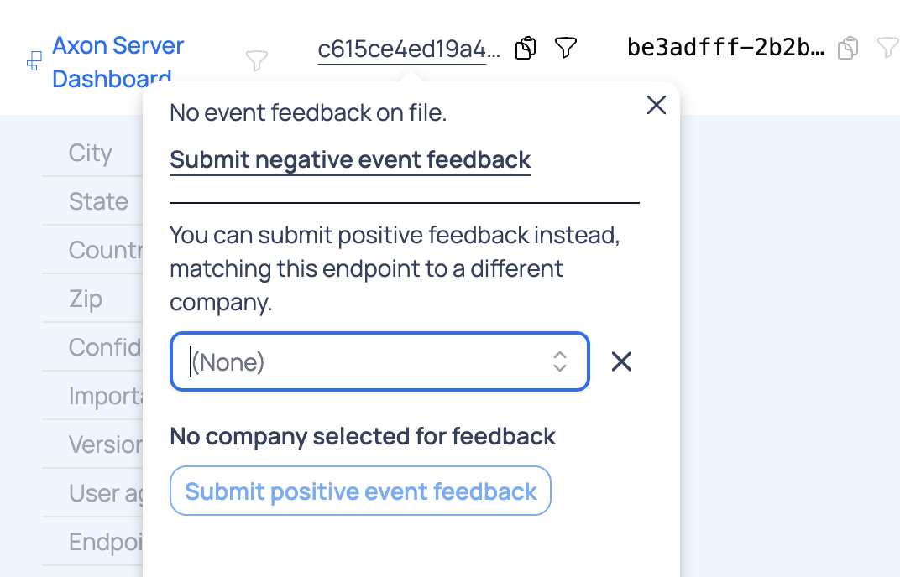

# Monthly Tracked Companies (MTCs)

MTCs are part of Scarf's legacy billing model.

This page applies only to organizations on existing legacy subscriptions. New subscriptions are not sold on the MTC model. For current billing guidance, see [Billing and Pricing](/billing-and-pricing/) and the [Scarf pricing page](https://about.scarf.sh/pricing/).

Scarf identifies which companies are viewing your documents, downloading your packages, or executing your software, and tracks their activity across the organization. In the legacy billing model, these are referred to as Monthly Tracked Companies (MTCs). Scarf enriches IP addresses with several metadata sources to provide the most accurate data possible.

## How MTCs work

> Legacy billing only: this section describes behavior for existing subscriptions that still use MTC quotas.

Your MTC quota defines the size of your **tracked company set** (sometimes called your active tracked companies): the number of companies Scarf can actively track at a time.

When an event arrives:
1. If the company is already in your tracked company set, it stays tracked and no new MTC credit is consumed.
2. If the company is new and you have available MTC capacity, Scarf adds it to the tracked company set and consumes one MTC credit.
3. If the company is new and your tracked company set is already full, Scarf removes the **least recently seen** company and adds the new one.

This rolling tracked set keeps enrichment focused on the companies currently interacting with your project. Scarf does not perform additional enrichment or company-level insights for traffic outside of your tracked company set, which helps keep enrichment costs down.

MTC quotas reset at the beginning of each calendar month.

### Visual model

Scarf will always show you the total number of companies interacting with your project at the bottom of the Company Insights page. Legacy-billing organizations can review their MTC usage in Organization settings.

## How visibility behaves across months

> Legacy billing only: this section does not apply to current usage-based plans.

MTCs are monthly credits, but company visibility is based on recent activity and your current tracked set.

- At the start of a new month, the tracked set is not wiped; it evolves as new companies are seen.
- If a previously visible company has no recent activity, it may no longer appear in current views.
- As new companies are matched during the month, they consume available MTC credits until your monthly quota is reached.
- Once your quota is reached, newly seen companies are not added until the next monthly reset.

In short: monthly credits reset, but the visible company list naturally changes with activity over time.

## Match Feedback

> Legacy billing note: match feedback can affect how companies are counted on legacy MTC subscriptions.

Match Feedback allows you to confirm, deny, or fix your company matches. Companies marked with negative match feedback will not consume MTCs the following month.

### Negative feedback
Use negative feedback when Scarf matched a company, but you do not want that company shown for the event source going forward.

### Positive feedback
Use positive feedback when you know Scarf's company match is wrong and you know which company it should be instead. This is especially useful when the detected company from IP-based enrichment does not match what you know from first-party context.

For example, a referrer URL or domain may clearly indicate that traffic came from a known company, while Scarf's current company match points to a different organization. In that case, submit positive feedback to associate that endpoint with the company you know is correct. This helps Scarf categorize future events from that same `endpoint_id` more accurately.

A mismatch between a referrer/domain and Scarf's company match can happen legitimately, because IP-based matching is probabilistic and can be wrong. If you have concrete evidence about the real company behind the traffic, positive feedback is the right way to correct it.

Typical reasons to submit positive feedback:

- You recognize the company from a known hostname, SSO domain, or internal company URL pattern in the referrer.
- The matched company appears to be a former employer or otherwise stale association for that IP range.
- Your team has direct knowledge that the traffic came from a different company than the one Scarf matched.

To submit a correction:

1. Open the event or company details where feedback is available.
2. Choose the option to submit feedback.
3. Select the company you know is correct for that event source.
4. Submit the feedback so future events from that endpoint can be categorized more accurately.

## FAQ
**How do I know how much of my MTC quota I’ve used?**

You will see a count of the currently used MTCs at the bottom of the Company Insights page.

It is also available on the Organization settings page.

**What if I want to see more companies?**

If you are on a legacy MTC subscription and need to see more companies, contact Scarf support or your Scarf point of contact to discuss your subscription options.

**Why do I occasionally see fewer companies on my Scarf home page than I am allocated?**

Scarf’s home page will always show you metrics from the last 30 days. Because the MTC quota resets at the beginning of each month, there is sometimes a perceived “gap” in the number of companies shown on the home page in the “Events by Company” chart. While the home page is designed to provide an “at-a-glance” overview of overall activity, it may be easier to get the full picture of the companies present within a given period (within the MTC quota) by visiting the Company Insights page.

**When I look at the results on the Company Insights page for last month (using the custom time range), I see that 3,045 of my 5,000 allocated companies are being shown. Why do I not see all 5,000 of my MTCs?**

Scarf displays the companies present at that point in time that are also present in the current month’s quota. In other words, 3,045 of the companies present last month are also in this month’s data. The remaining companies we matched last month are inactive in the current month’s data. As companies interact with your project in that given month, they will be added to the count until you reach your full MTC quota.

**Why can a bookmarked company page stop showing activity later?**

A bookmarked company may no longer be in your currently visible tracked set due to monthly quota limits and changing activity patterns. When that happens, Scarf may limit activity detail for that company.

What to do:
- Verify current MTC usage in your Organization settings.
- Check whether your team needs a higher MTC quota for broader continuity.
- If this looks unexpected, contact support with the company domain and date range so we can help review.
