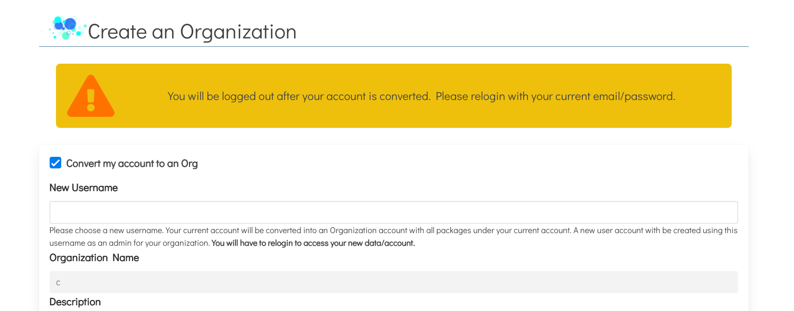
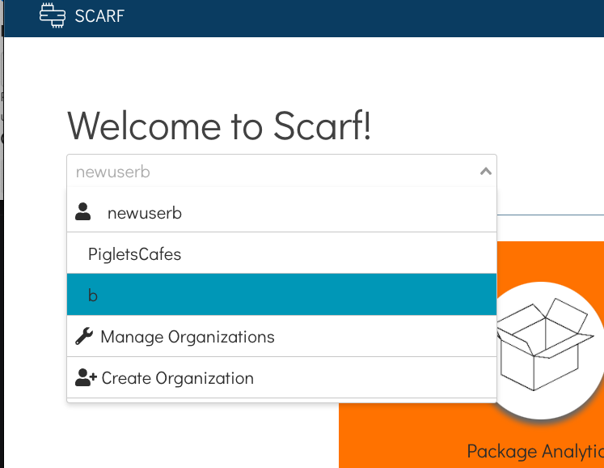

### CREATING AN ORGANIZATION

To create an organization, navigate to your Scarf dashboard. Clicking the username dropdown will bring a few new options:

> Your dashboard
> Dashboards for each organization you belong to
> Manage organizations
> Create an organization

Here, you’ll want to click on “Create an organization”:

{ align=left }

This will take you to the Create an Organization form:

{ align=left }

There are two distinct ways to create an organization:

### Converting your current account

If your current username is what you would like your organization to be called, you can  to convert your account into an organization. To do this, please follow the steps below:

**STEP 1:** Check “Convert my account to an Org” at the top of the form.
	
{ align=left }

This action takes your current username and transfers it to your new organization. You will be prompted to enter a new username that will be given to your user account to replace the transferred one. All of your account’s packages will be transferred to the new organization.

**STEP 2:** Choose a fresh username of your liking!

{ align=left }

Your new username will be used to generate Scarf links for your user account as usual.

**STEP 3:** Fill out the rest of the form.

{ align=left }

**STEP 4:** Click submit! The conversion process will begin, and your account’s packages will be moved to the new organization. You will be logged out and can then log back in with your new username. 

After logging in, you’ll see that you’ll be taken to the new user dashboard. Don’t be alarmed! This means your packages have been moved successfully under your new organization.

{ align=left }

If you click the dropdown at the top, you’ll notice a new option underneath your username. That’s correct! It’s your new organization.

Using the dropdown menu, you can switch views between your personal user and your various organizations:

{ align=left }

### Directly creating an organization
**STEP 1:** Choose an organization name and fill out the form with the correct details.

{ align=left }

**STEP 2:** Hit submit! You will be taken to the Manage Organizations page, where your new organization will be listed.

{ align=left }