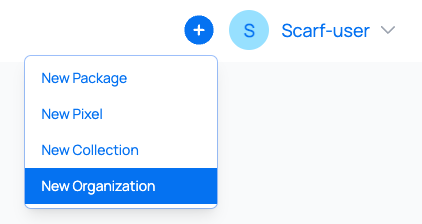
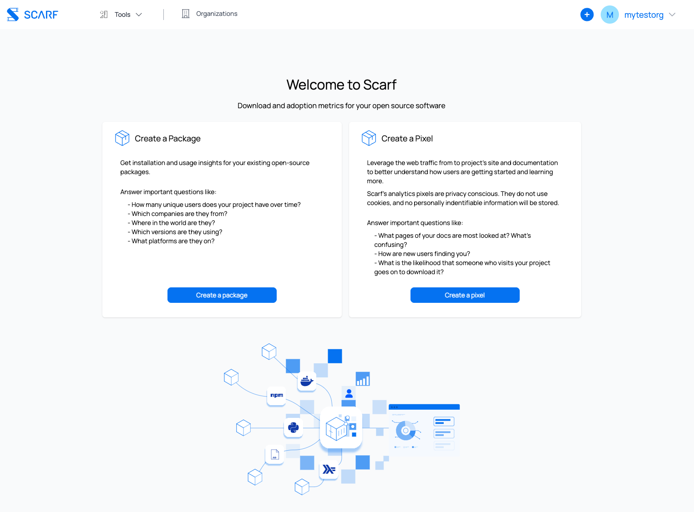

# Organizations

## Creating an organization

To create an organization, in the header menu click on the `Organization` button

alternatively, you can access it via the plus icon and selecting `New Organization`

If you haven't already setup an organization you will be presented with the following screen:

As you can see you are presented with two options:

1. Create Organization: This is if you are happy to keep your user and create a free standing organization.

2. Convert Account to organization: If it happens that you've added lots of new packages and found that you'd like to put these under an organization umbrella this is the perfect way to achieve that.

## Converting your current account to an organization

If your current username is what you would like your organization to be called, you can convert your account into an organization. To do this, please follow the steps below:

From the splash screen shown above click on `Convert Account to organization`. You will be presented with the following:

Click on `Get Started` and you will see:

You now need to select a new username as your current username will be converted into an organization and the new username will be the owner of this newly created organization. Fill in the other inputs as required.

Lastly before clicking `Save` be mindful that all of your account’s packages will be transferred to the organization.

That's it you have now converted your account into an organization, the next screen you will see is the organization screen.

Now as previously prompted log out and back into your account. You will be presented with the following home page just like when you first open your account. Do not be alarmed, not all is lost it's just that all your data/packages have been transferred to your new organization.

To access these you now have access to new menu items in the top right header menu, it will look as follows:

Now select the organization and you will see all of your previously created packages and data.

A little helpful feature is when looking at the top right header menu you will now see two circles. The larger being what organization you are accessing and the smaller one being the user you are doing it with.

If you ever want to go back to your user then simply select it in the dropdown menu.

## Directly creating an organization
In a very similar fashion to the converting you current account to an organization, simply select the option from the plus icon dropdown menu.

The next screen will prompt you to add your new organization name and other details, click `Save`

Et voilà! You now have new organization

