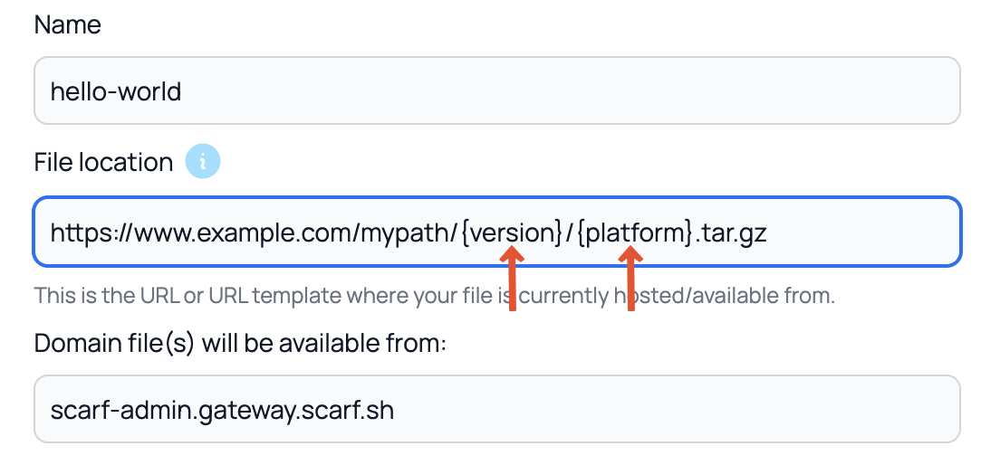
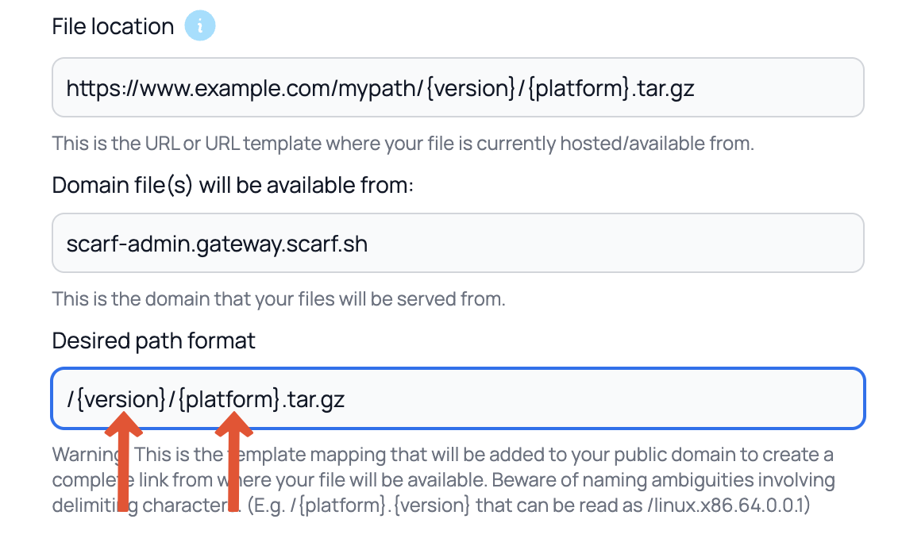
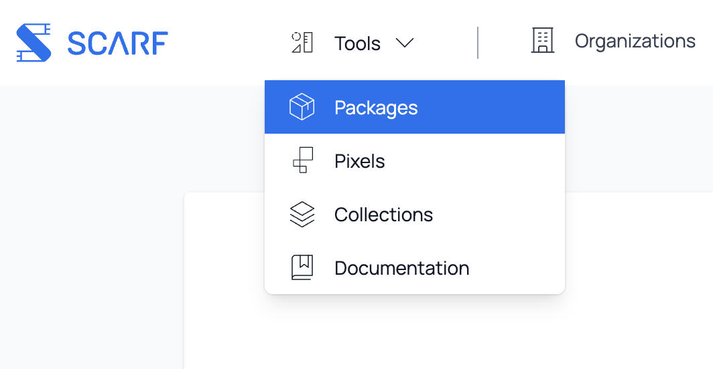
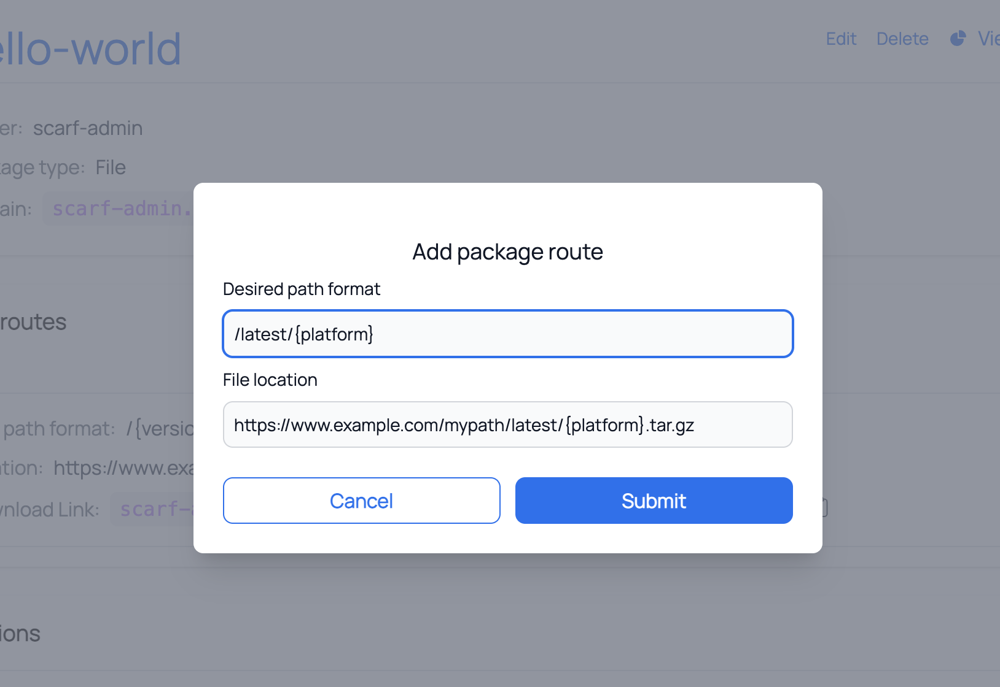

# Setting up Scarf Packages

## Prerequisites

- You will need to sign up for a [Scarf account](https://app.scarf.sh/register).
    > _**Note:** You can sign up with a valid email address or your GitHub account._
- To track a container, it must be published to a public registry; eg Docker Hub, GitHub Container Registry.

> **Note:** This guide will use the `hello-world` [docker image](https://hub.docker.com/_/hello-world).

## Docker Packages

### Creating a Docker Package

Using Scarf, users can pull your Docker container images via Scarf Gateway using your custom domain.

1. Once signed in to Scarf, navigate to the home page.
2. Click plus icon in the top navigation, then select `New Package`.
    
3. In the first drop-down click on the package type you would like to create. For this section you will click `Docker`.
    
4. Enter the current pull command for your Docker container.

    ```bash
    # `hello-world` package

    docker pull hello-world
    ```

    

5. Optional: You can add a custom domain or use the domain provided by Scarf Gateway.
6. Click the `Submit` button to be redirected to a success screen with some additional information as to what you can do next.
7. Click on on `Go to your package` to view your package details view.
    

Now you’re all set to start tracking your Docker images with Scarf.
Any time your image is downloaded, Scarf will report the following information:

- System and OS statistics of your users
- Company information of your users
- Downloads by versions/tags

In the next section, you will create a tracking pixel that can be added to your project’s documentation or any other web properties associated with your project.

### Downloading Docker Packages

In this section you will download your package with the pull command found in your package dashboard to start fetching data.

1. Navigate to your package details view.
    
2. Copy the Pull command.
3. Navigate to a terminal on your computer and run the Pull command.
    
    _**Note:** Make sure the docker daemon is running on your computer._
4. Back to the package details view and click on `View Analytics`. You should now see the Package Insights starting to populate with data.
It will usually take 30 minutes and up to 2-3 hours before you see data pulled in. Every time a user pulls your Docker container images from Scarf Gateway the data in your Package Insights will be updated.
    

## File Packages

File Packages on Scarf are a flexible and low-level package type that can track visits and downloads on arbitrary URLs. File packages were originally created to track published tar balls, but it has since expanded to many other use cases and will likely be renamed in future versions of Scarf. You can think of File Packages as a powerful and fully customizable link shortener. Common use cases include:

- Tracking downloads of GitHub release artifacts
- Tracking downloads of every artifact on your company/project "downloads" page
- Tracking downloads of Homebrew packages from a tap/formula that you control
- Sending custom telemetry or other events from your application
- Tracking and attributing visits to marketing and sales content on your site.

### Creating a File Package
1. Once signed in to Scarf, navigate to the home page.

2. Click plus icon in the navigation, then select New Package.


3. In the first drop-down click on the package type you would like to create. For this section you will click `File`.


4. Select the package owner from the dropdown.


5. Give your package a name.


### Adding an Outgoing and Incoming URL
This section explains what the Outgoing and Incoming URLs are and how to use a URL template.

1.) Add the URL path where your files are currently located. You can add a simple URL or a URL template like in the example. `https://www.example.com/mypath/{version}/{platform}.tar.gz`
This example uses 2 variables `{version}` and `{platform}`.
 > Note: The Outgoing URL is the full URL to your asset on your HTTP/S hosting provider. It can be a URL template but if you use variables in your URL they need to also be used in your Incoming Path that define in the next step.



2.) Choose the domain where your files should be available from. You may choose to use your own domain for serving files. You may also choose to use `<username>.gateway.scarf.sh` provided by default by Scarf.

3.) Add the Incoming URL Path where Scarf will direct requests to fetch a file asset.

> Note: Any variables used in your Outgoing URL path need to match your Incoming URL.

 

4.) Click **Submit**.

### Adding Additional Routes
This example will show how to add an additional route. For curl-runnings an additional route that redirects to a specific version will be added, in this case, the most recent package release.

1.) In the top menu click on Tools then in the drop down menu click on Packages.


2.) In the package list dashboard there will be a list of all your packages. These can be filtered by type of packages by selecting the package types you'd like to see. In our example as we just created a file package we're going to want to select File.

3.) Navigate to our newly create file package and in the top right of the box click the `View Details` button.


4.) In the popup modal, use the `File location` input to add a new host URL. You can use a template URL here.

Example:

`https://www.example.com/mypath/latest/{platform}.tar.gz`

5.) Next, add the desired path format for your files. Make sure the variables from your Outgoing and Incoming URLs match if you use a template URL.

Example:

`/latest/{platform}`



6.) Click the `Submit` button.

7.) The modal will close and you will see the additional route you just added.


## Event Collection Packages

Event Collection Packages on Scarf are another flexible package type purpose built for telemetry data in general. Event data can be sent to a public Scarf Gateway URL of your choice, or by bulk ingesting events through our authenticated API. Event Collection Packages are an alias of File packages and share all the same traits. Common use cases include:

- Sending custom telemetry or other events from your application
- Importing historical event data from an external application into to Scarf

### Creating an Event Collection Package
1. Once signed in to Scarf, navigate to the home page.

2. Click plus icon in the navigation, then select New Package.


3. In the first drop-down click on the package type you would like to create. For this section you will click `Event Collection`.


4. Select the package owner from the dropdown.


5. Give your package a name.


### Adding an Incoming URL
This section explains what the Outgoing and Incoming URLs are and how to use a URL template.

1.) Add the URL path where your events will be collected. This is the user visible endpoint your application will connect to for event submission. This setting while required is not relevant when submitting events via the [Event Import API](https://docs.scarf.sh/event-import/).
 > Note: The Outgoing URL is the full URL to your asset on your HTTP/S hosting provider. It can be a URL template but if you use variables in your URL they need to also be used in your Incoming Path that define in the next step.


2.) Choose the domain where your events will be submitted. You may choose to use your own domain or you may choose to use `<username>.gateway.scarf.sh` provided by default by Scarf.

3.) Click **Submit**.

### Configuring Event Collection
Once an Event Collection package has been created, you are ready to collect [Custom telemetry](https://docs.scarf.sh/custom-telemetry/)

If you have questions or need help, join our [Slack community](https://tinyurl.com/scarf-community-slack).
