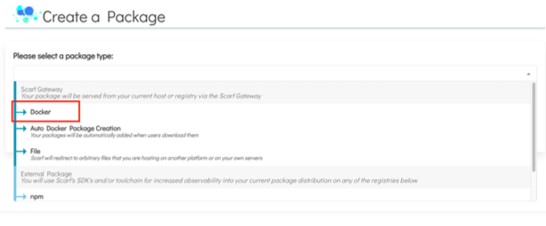
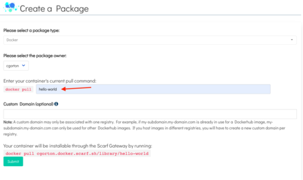
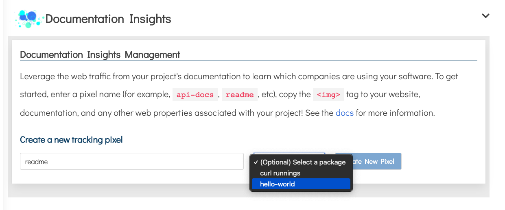
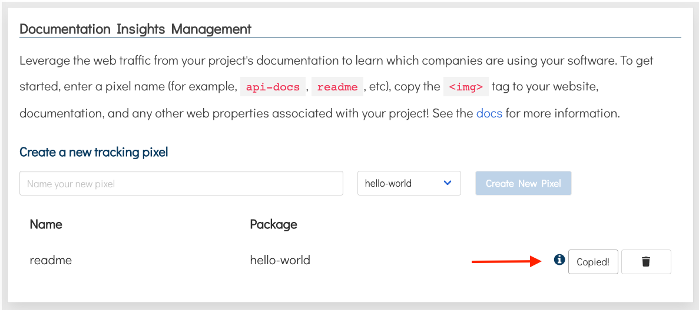
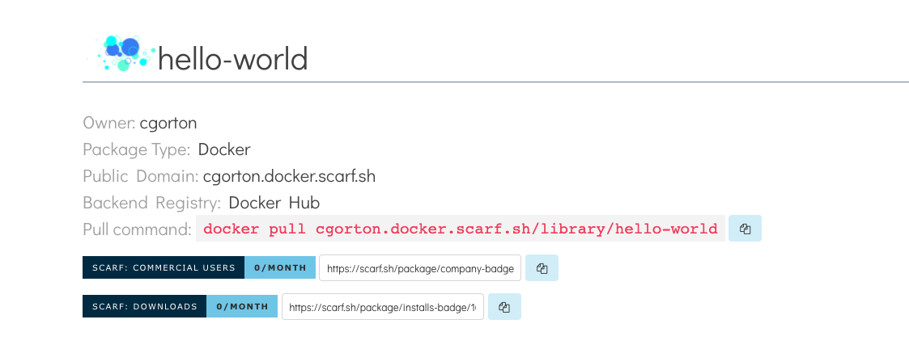
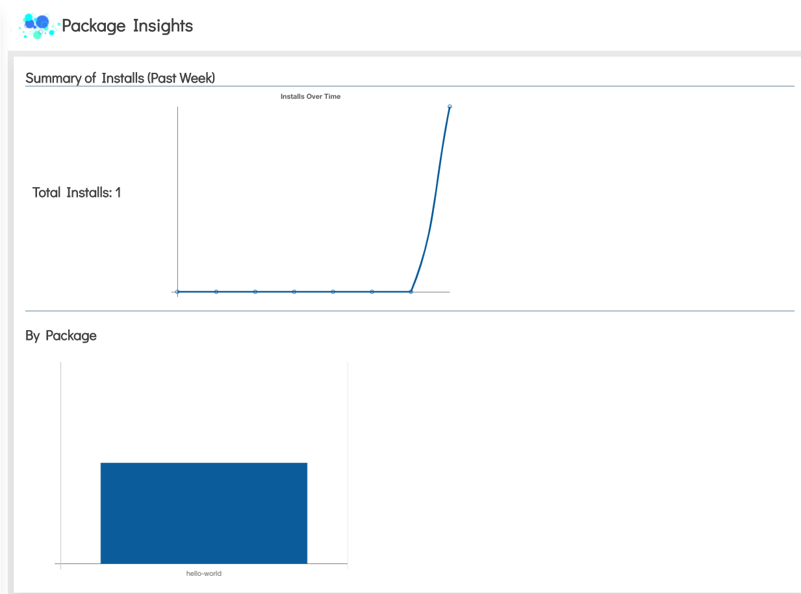

# Introduction

Scarf Gateway is a service that provides a central access point to your containers and packages, no matter where you host them.

In this guide, you will learn:

- How to create track pulls of your Docker containers with Scarf
- How to create a tracking pixel to track views of your package's documentation
- How to download your packages and fetch associated pixels

## Prerequisites

- You will need to sign up for a [Scarf account](https://scarf.sh/signup).
  You can sign up with a valid email address or your GitHub account.
- The container you're looking to track must be published to an existing public registry, eg Docker Hub, GitHub Container Registry. 
  This guide will use the `hello-world` [docker image](<(https://hub.docker.com/_/hello-world)>).

### Creating a Docker Package

Using Scarf, users can pull your Docker container images via Scarf Gateway using your custom domain.

1.  Once signed in to Scarf, navigate to the home page.

2.  Click `New Package` in the navigation.

3.  Select the Create a Package drop-down and click on the package type you would like to create. For this section you will click `Docker`

    
4.  Enter the current pull command for your Docker container.
    The Docker command for the `hello-world` package is `docker pull hello-world`.

    
5.  Optional: You can add a custom domain or use the domain provided by Scarf Gateway.

6.  Click the `Submit` button to be redirected to your package dashboard.

Now you’re all set to start tracking your Docker images with Scarf.
Any time your image is downloaded, Scarf will report some basic information:

- System and OS statistics of your users
- Company information of your users
- Downloads by versions/tags

In the next section, you will create a tracking pixel that can be added to your project’s documentation or any other web properties associated with your project. .

### Creating a Tracking Pixel for Your Package

Tracking pixels are used to leverage the web traffic from your project’s documentation to learn which companies are using your software.

1. Navigate to https://scarf.sh/home

2. Under Documentation Insights enter a name for the pixel. For this example enter the name `readme`.
3. Select the newly created `hello-world` package.

   
4. Click `Create a New Pixel`
5. Copy the newly created pixel  tag and add it to your website, documentation, or any other web properties associated with your project.

   

For more information on Tracking Pixels see the Documentation Insights section of our docs.

### Downloading Packages and Fetching Associated Pixels

In this section you will download your package with the pull command found in your package dashboard to start fetching data.

1. Navigate to your package dashboard.
   
2. Copy the Pull command.
3. Navigate to a terminal on your computer and run the Pull command.
   

**Note:** Make sure the docker daemon is running on your computer.

4. Navigate to https://scarf.sh/home. You should see the Package Insights starting to populate with data.

It may take a few minutes before you see data pulled in.

Every time a user pulls your Docker container images from Scarf Gateway the data in your Package Insights will be updated.

## What’s Next?

For more detailed information about Scarf Gateway please see the [Scarf Gateway](https://docs.scarf.sh/gateway/) section of our documentation.
If you have questions or need help, join our [Slack community](https://tinyurl.com/scarf-community-slack).
