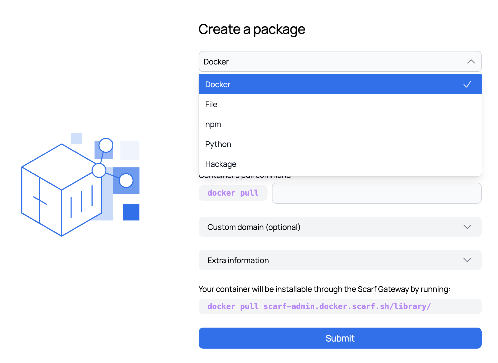
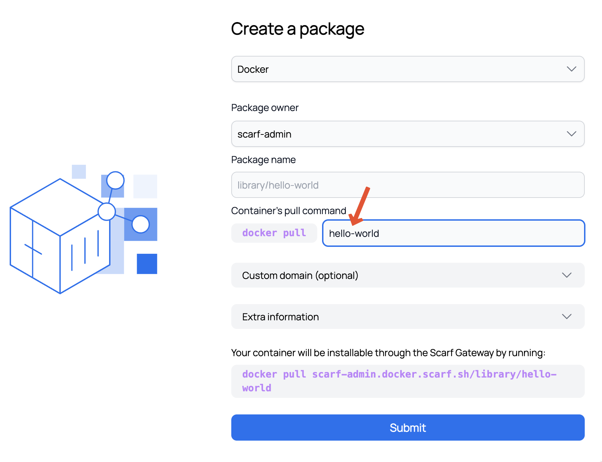
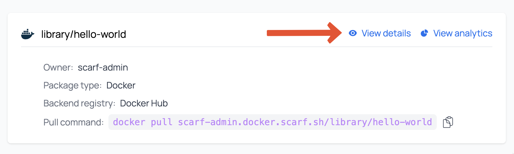
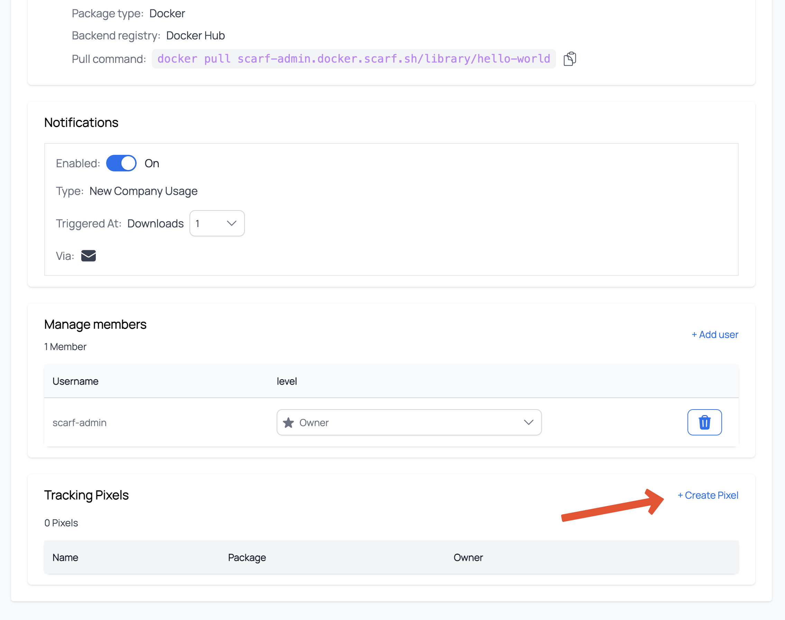
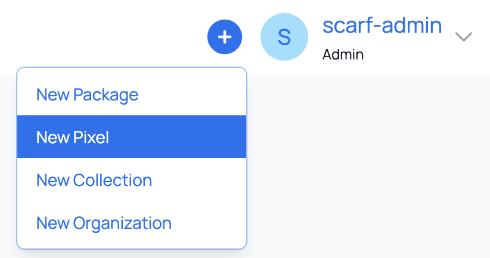
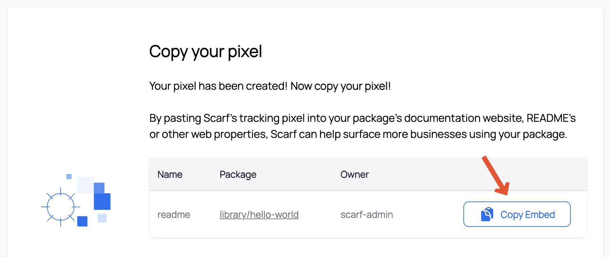
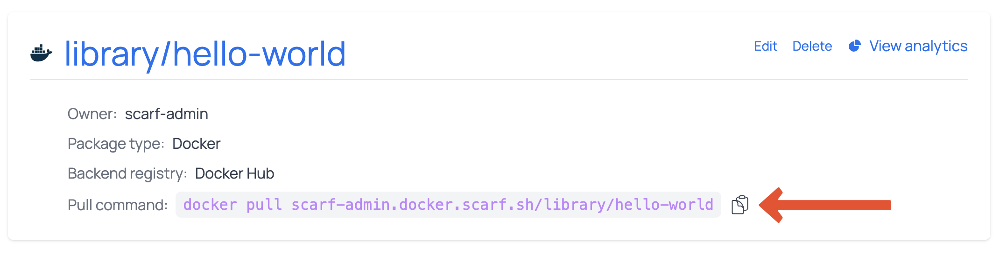
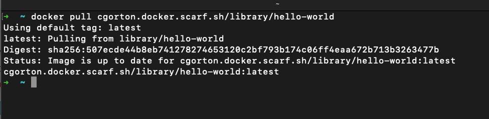
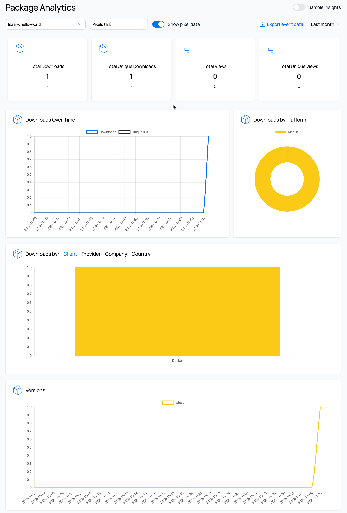

# Quick Start

## Introduction

Scarf is a platform that helps you track download and usage analytics for your open source project. Scarf can collect analytics for you by:

- Tracking the downloads of your software at the point of distribution, regardless of how they are distributed (Docker containers, binaries, Python packages, npm packages, and more).
- Tracking user interactions with your web artifacts (your marketing site, your documentation, and your READMEs), without introducing cookies or JavaScript.
- Enriching any existing data you're already collecting on software usage.

In this guide, you will learn:

- How to create track artifact downloads with Scarf -- we will use a Docker container as an example.
- How to create a tracking pixel to track views of your package's documentation
- How to test your setup by downloading your Scarf packages and fetching your associated Scarf pixels

## Prerequisites

- You will need to sign up for a [Scarf account](http://app.scarf.sh/register).
  You can sign up with a valid email address or your GitHub account.
- The container you're looking to track must be published to an existing public registry (e.g., Docker Hub or GitHub Container Registry).
  This guide will use the `hello-world` [docker image](https://hub.docker.com/_/hello-world).

### Creating a Docker Package

NOTE: This quickstart outlines the process for tracking downloads of a Docker container via Scarf Gateway, but you can track downloads of many other types of OSS artifacts as well. Learn more about other package types on Scarf [here](/packages).

Scarf Gateway is a service that provides a central access point to your containers and packages, no matter where you host them. Users can pull your containers via a Scarf provided domain, or custom domain that you CNAME to Scarf.

1.  Once signed in to Scarf, navigate home by clicking on the Scarf icon in the top-left corner of the screen.

2. Click the plus icon in the top navigation bar, then select `New Package`.

3. In the first dropdown, click on the package type you would like to create. For this section, you will click `Docker`.

4.  Enter the current pull command for your Docker container.
    The Docker command for the `hello-world` package is `docker pull hello-world`.

    

5. Optional: You can add a custom domain or use the domain provided by Scarf Gateway. If you choose to create a custom domain, you will need to [CNAME your custom domain to the domain provided by Scarf Gateway](https://www.cloudflare.com/learning/dns/dns-records/dns-cname-record/).

6. Click the `Submit` button to be redirected to a success screen with some additional information as to what you can do next.

7. Click on `Go to your package` to view the Package Details.

Now you’re all set to start tracking your Docker images with Scarf.
Any time your image is downloaded, Scarf will report some basic information:

- System and OS statistics of your users
- Company information of your users
- Downloads by versions/tags

In the next section, you will create a tracking pixel that can be added to your project’s documentation or any other web properties associated with your project.

### Creating a Tracking Pixel for Your Package

Tracking pixels are used to leverage the web traffic from your project’s documentation to learn which companies are using your software.

1. Navigate to the [Scarf homepage](https://app.scarf.sh/home/).

2. Pixels can be created from two locations, one is directly from the packages details view. In top menu click on `Tools` > `Packages`. Then in the next screen find our package `hello-world` and click on `View details`.

on the next screen scroll down to the `Tracking Pixel` box and click `Create pixel`.

The second way is to click plus icon in the top navigation, then select `New Pixel`.

3. You will now see the create pixel page. For this example we'll name our pixel `readme`.

4. Then attach it to our the newly created `hello-world` package. (if you came to the `create pixel page` via `package details  page` this will be automatically selected)

4. Finally click `Submit`

5. Copy the newly created pixel `` tag and add it to your website, documentation, or any other web properties associated with your project.

   

For more information on Tracking Pixels see the [Documentation Insights](../web-traffic/) section of our docs.

### Downloading Packages and Fetching Associated Pixels

In this section you will download your package with the pull command found in your package dashboard to start fetching data.

1. Navigate to your package details view.
   
2. Copy the Pull command.
3. Navigate to a terminal on your computer and run the Pull command.
   
**Note:** Make sure the docker daemon is running on your computer.

4. Back to the package details view and click on `View Analytics`. You should now see the Package Insights starting to populate with data.
It will usually take 30 minutes and up to 2-3 hours before you see data pulled in.

Every time a user pulls your Docker container images from Scarf Gateway the data in your Package Insights will be updated.

## What’s Next?

For more detailed information, please see the relevant documentation;

- [Packages](/packages)
- [Scarf Gateway](/gateway)

If you have questions or need help, join our [Slack community](https://tinyurl.com/scarf-community-slack).
