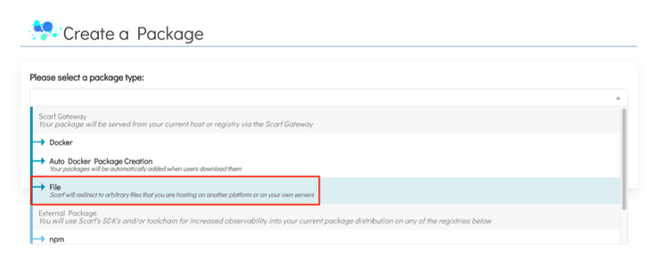
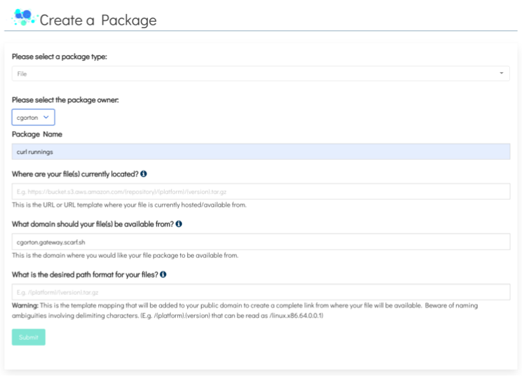
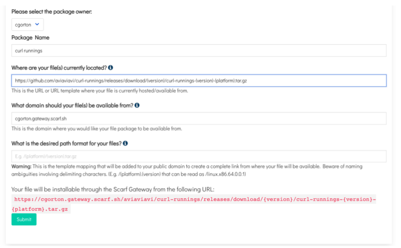
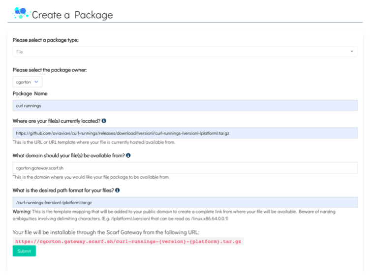
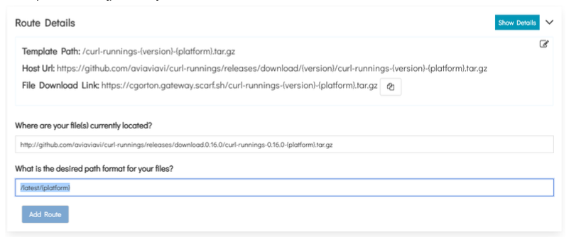

# Introduction

Scarf Gateway is a service that provides a central access point to your containers and packages, no matter where you host them. Scarf Gateway offers support for “File Packages”, which can be arbitrary files, API endpoints, or even simply URLs.

In this guide, you will learn:

- How to create track downloads of your file packages.
- How to add additional routes

## Prerequisites

- You will need to sign up for a [Scarf account](https://scarf.sh/signup).
  You can sign up with a valid email address or your GitHub account.

### Creating a File Package
1. Once signed in to Scarf, navigate to the home page. 

2. Click `New Package` in the navigation.

3. Select the Create a Package drop-down and click on the package type you would like to create. For this section you will click `File`
 

4. Select the package owner from the dropdown.

5. Give your package a name.

## Adding an Outgoing and Incoming URL
This section explains what the Outgoing and Incoming URLs are and how to use a URL template.

1.) Add the URL path where your files are currently located. You can add a simple URL or a URL template like in the example. `https://github.com/aviaviavi/curl-runnings/releases/download/{version}/curl-runnings-{ver sion}-{platform}.tar.gz`

This example uses 2 variables `{version}` and `{platform}`.

> Note: The Outgoing URL is the full URL to your asset on your HTTP/S hosting provider. It can be a URL template but if you use variables in your URL they need to also be used in your Incoming Path that define in the next step.

2.) Choose the domain where your files should be available from. You may choose to use your own domain for serving files. You may also choose to use `<username>.gateway.scarf.sh` provided by default by Scarf.

3.) Add the Incoming URL Path where Scarf will direct requests to fetch a file asset.
> Note: Any variables used in your Outgoing URL path need to match your Incoming URL.

4.) Click **Submit**.

## Adding Additional Routes
This example will show how to add an additional route. For curl-runnings an additional route that redirects to a specific version will be added, in this case, the most recent package release.

1.) In your file package dashboard navigate to the Route Details and click the `Show Details` button.

2.) In the `Where are your file(s) currently located?` input add a new host URL. You can use a template URL here.

Example:

`http://github.com/aviaviavi/curl-runnings/releases/download.0.16.0/curl-runnings-0.16.0-{platfor m}.tar.gz`

3.) Next, add the desired path format for your files. Make sure the variables from your Outgoing and Incoming URLs match if you use a template URL.

Example: 

`/latest/{platform}`

4.) Click the `Add Route` button.

## What’s Next?

For more detailed information about Scarf Gateway please see the [Scarf Gateway](https://docs.scarf.sh/gateway/) section of our documentation.
If you have questions or need help, join our [Scarf-Community workspace.](https://tinyurl.com/scarf-community-slack)
