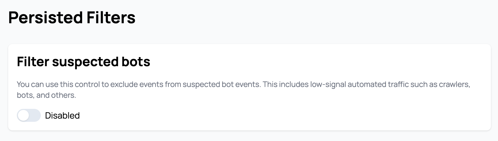
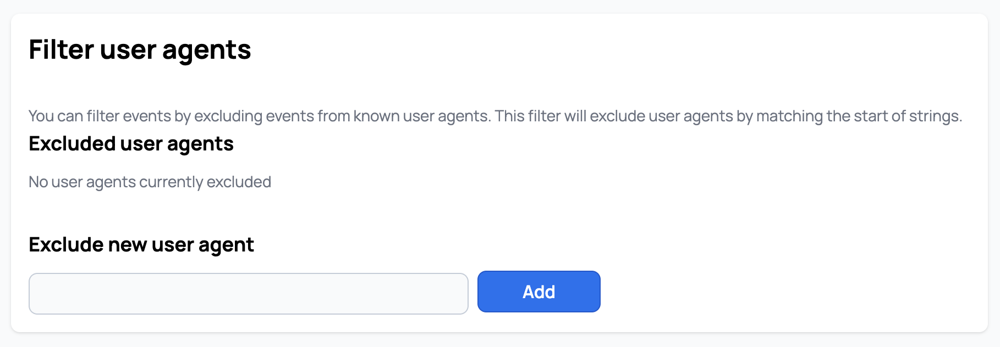

# User Guide & Best Practices

## Introduction

This is a user guide to best practices when using Scarf.  Consider this not only a guide but also an FAQ.  

Currently this guide contains:

1. How to use Scarf Data in existing  sales and marketing efforts
	1. Events you should be tracking
	2. The goal is ongoing usage 
	3. How to use Scarf to infer ongoing usage 
	4. Basic lead scoring with Scarf
	5. Sample customer journey 
	6. What to do with companies identified by Scarf
	7. Common ways to inject Scarf into existing sales/marketing activities 
	8. Common ways for startups to build their first sales and marketing processes 
2. How to use confidence intervals
3. Best Practices to track multiple projects and packages
	1. Handling different projects
	2. Handling different versions
	3. Handling different platforms
	4. Container best practices
	5. Variables 
    6. Pixels for each project	
4. Tracking external link clicks

## How to use Scarf data in existing sales and marketing efforts

### Events we should be tracking:

There are 3 events we would suggest everyone track. 

- Downloads/Pull events
- Views of documentation
- Views of content/website (pages, blogs, tutorials)

The first is *downloads* (no matter if it's direct on your website, via a container registry, or via public repositories. Scarf allows you to track and aggregate downloads across all these different channels). This is probably the most valuable action. A download means someone has not only some interest in your product but enough interest to try it out.

There are three aspects to downloads which you should be paying attention to:

- The number of downloads from unique sources at a company - more than one machine/source downloading is good.
- The volume of downloads over a time period at the company - you want to see continued downloads over time, this implies ongoing usage.
- Is the company downloading newer versions of the software over time - this is gold as it implies not only are they downloading but they are trying to keep things up to date and implies the software is critical enough to have maintenance procedures around it.

The second on the list is *documentation views*. People using your software will often have questions about how to install, use, and upgrade the software. You will see patterns evolve over time in the usage of the software docs depending on the software. Initially you will see more traffic to the installation and setup sections. This coupled with download events is a great indicator of testing or trying things out. Then users will evolve more into troubleshooting or optimization views. See more page views shift to this is normal. Then you should see views to readmes or upgrade pages as they settle into maintenance and sustain mode. Ultimately I would be looking for views over an extended period of time to ensure they are invested and not just kicking the tires.  

The third on the list is *content/website views*. Not all views will be coming from docs, in fact for commercial purposes there are certain pages on your website that may be highly predictive of potential interest in becoming a customer (i.e. the pricing pages). But I recommend looking for ongoing views and traffic hitting blogs and other news on the product and upcoming releases.  

For each of the events, I would recommend breaking down all the activities into either good/better/best or low/medium/high impact events. 

Here is a suggested list of criteria when it comes to classifying events:

|Event | GOOD | BETTER	| BEST |
| ---- | ---- | ------ | ----- |
| Downloads |	1 or more downloads in a week.	| More than 1 download over a 30-day period. |	Multiple downloads over a 90-day period, including incremental downloads of new versions. |
| Documentation Views |	Repeated views on installation and setup instructions.	| Documentation views spanning more than 30 days from multiple sources. | More than just install page views.	Documentation views spanning more than 90 days from multiple sources. Doc views on upgrades and maintenance procedures. |
| Website Traffic |	Multiple pages visited and viewed by 1 company over a week period. | Multiple pages visited and viewed by 1 company over a 30-day period. | Page views to medium value content. I.e. Reading technical blogs, visiting forum pages, product feature pages. | Multiple pages visited and viewed by 1 company over a 30-day period. Page views to high-value content. I.e. Visiting the pricing pages, visiting but not signing up on the signup page, etc. |

### The Riskiest But Most Valuable Metric: Ongoing Usage

While the three activities above are straightforward and generally not viewed with too much concern, there is a fourth activity or metric you can (and probably should) track.  An essential, albeit controversial, activity that serves as a highly valuable metric for any organization seeking to understand the usage patterns of its software - the use of 'call-home' functionality, also known as ongoing usage tracking. The call-home functionality is a mechanism within your software that sends a signal, or a 'ping', back to a designated server or gateway. This signal provides you with real-time information about your software's usage in live production environments, surpassing the insight level gained from just tracking downloads.

While download data can indicate interest and repeated use of your software, the ongoing, consistent 'ping' or call-home activity serves as a definitive predictor of your software's actual usage. Consider this the 'Nirvana' of metrics for your projects, the golden standard that allows you to measure the exact magnitude of your active install base and the frequency of software usage and deployment.

However, implementing this mechanism requires a degree of technical adaptation. Platforms like Scarf, for instance, offer this capability out of the box. But to make full use of it, you'll need to adjust your application accordingly. There are different ways to accomplish this; for JavaScript applications, a package called [`scarf-js`](https://www.npmjs.com/package/@scarf/scarf) can be used. Alternatively, a lightweight, background 'ping' or activity back to a Scarf gateway event can be employed. This ping can be triggered when your application starts up, is used, or at any other specified event.

In essence, your application would asynchronously call back to the gateway website, which doesn't return any data but rather tracks that the application was active. If you can successfully implement this, you can then monitor the number of unique pings over a certain period from various sources. This is incredibly valuable for lead scoring as it provides consistent, ongoing proof of life from these systems, making it the most valuable event or activity you could track.

### How to use Scarf to infer ongoing usage

- Look for companies activities over an extended period of time. Repeated downloads over 30/90/180 days is a very predictive indicator of ongoing reliance 
- Look for companies who download incremental versions of your software over time
- Look at documentation views over time, especially upgrade docs and operational docs from the same user/company
- Consider adding a ping or call back within your software to an empty page behind a Scarf Gateway URL, this will allow you see these calls within Scarf.  

### Basic lead scoring and customer journey mapping with Scarf

Not all people visiting your website and downloading your software are equally likely to become customers. In fact you will find 3x, 5x, or even 10x more drive by traffic as you will find those interested in commercial offerings. To become efficient at finding which companies and users you should focus on, let's explore the concept of “lead scoring”. 

Lead scoring is a methodology used by sales and marketing departments to determine the worthiness of leads, or potential customers, by assigning values to them based on their behavior relating to their interest level in products or services. These values, or scores, are derived from a variety of factors like the professional information they've submitted, how they've engaged with the company's website, or their response to marketing efforts. The purpose of lead scoring is to prioritize leads who are more likely to convert into customers, allowing teams to focus their time and resources effectively. It's a vital part of creating an efficient sales and marketing strategy.

If you've already established a lead scoring system and are utilizing marketing software, consider events in open-source channels as additional data points to further qualify or uncover leads. For instance, a software download could be treated as a high-value (or high-score) activity, whereas a documentation view might be scored similarly to other website visits. It could be beneficial to categorize documentation and page views into high, medium, and low scoring pages, as certain pages (like pricing or install pages) can be more predictive and valuable than others.

The key distinction between traditional lead scoring and the incorporation of open-source download and traffic data lies in the summarization of data at the company level, requiring decisions on scoring criteria. Most marketing lead management tools track users based on sign-ups, cookies, or other mechanisms, capturing specifics such as Matt from Scarf signing up for a webinar. With data from anonymous sources, the best we can do is infer that someone from Scarf has downloaded your software.

The question then becomes: if you know Matt attended a webinar and works at Scarf, does the Scarf download make Matt a more qualified lead? Or should you shift your focus to other individuals at Scarf, possibly higher up in the management hierarchy? There's no absolute right or wrong answer, but my inclination would be to enrich the data of the known user who has already shown interest.

Additionally, it's important to note that software downloads can often be automated. Seeing ten downloads a day doesn't necessarily equate to thousands of servers or the potential for a massive deal. This data needs to be scrutinized, at the very least, by examining the unique systems or origins from where these downloads originate.

Lastly, when incorporating open-source downloads and traffic data, the timeline of events becomes critical. A single download could mean anything, but consistent downloads over several months, especially with each new version release, suggests a real, potentially highly qualified user.

### Customer journey example with Scarf
| Different Phases of Interest                                               | Description                                                                                                                                        | Events                                                                                                                                                                 | Action                                                                                                                                                                              |
|----------------------------------------------------------------------------|----------------------------------------------------------------------------------------------------------------------------------------------------|------------------------------------------------------------------------------------------------------------------------------------------------------------------------|-------------------------------------------------------------------------------------------------------------------------------------------------------------------------------------|
| **Passive interest:**  Hello World                                               | Someone discovered or visited your website. They may or may not have any interest in your software or projects.                                      | Web traffic to docs or websites over the course of 1 or 2 days.                                                                                                         | I would not take any action here.                                                                                                                                                   |
| Intrigued in your software:  This looks interesting                          | Someone takes more than a drive by interest in your software.  They are truly interested in what you have.                                          | Documentation views. Looking at install docs and/or feature lists. Typically this is over multiple days.                                                                | I would consider promoting content tothat company's target audience (engineers?) on other external channels.                                                                         |
| Trial &amp; Exploration:  Let me try this out                                | They move from just learning about the software to actually downloading it.                                                                         | Documentation and website views of high value pages along with at least 1 download event.You still see this traffic over multiple days but typically over a week or two. | I would recommend promoting blogs or how-tos that are interesting to this group of customers. You could even promote this content directly on your website when these visitors appear. |
| Testing &amp; Evaluation:  I wonder if I can usethis for this project       | Now someone is looking deeper into this and is starting to either use it or seriously consider it.                                                  | Sustained page views and multiple downloads over a month period.                                                                                                        | Here is where additional content promotion is still a good idea, but where there is a strong commercial offering targeting these customers can be effective.                          |
| Implementation &amp; Reliance:  This is cool, let's use this in production | Someone is using this over a longer period of time and looks to be beyond merely testing/trying out.                                               | If you see activities (both downloads and traffic) spread over a 90 day period, there is a high confidence in their usage in a critical space.                         | This is the best time to seek out conversations.  - Cold outreach  - Targeted ads  - Seek out devs at conferences                                                                         |
| Maintenance &amp; Ongoing Upkeep:  Keeping things updated and safe          | Someone has been using your software for months and is grabbing new versions of your software and reading readmes or regular updates (like blogs). | Look for activities over months (3-12 months), with downloads of multiple versions. Also look for views on readmes or product specific content (blogs, etc).           | This is the best time to seek out conversations.  - Cold outreach  - Targeted ads  - Seek out devs at conferences                                                                         |
| Waning Interest &amp; Potential Churn:  Uh oh… this user is at risk          | Usage is dropping and there is risk that this user may turn from an active user to a former user.                                                  | If you see massive drop offs in traffic and downloads over a 30 day period this sends up red flags.                                                                    |

### What to do with companies identified by Scarf

Effectively employing this data requires a strategic and tailored approach to meet the unique needs and goals of each organization. Below are some general recommendations that apply to most situations:

- Understand Your Audience: Use download data and website traffic information to build a deeper understanding of your audience. This involves analyzing who is downloading your software, viewing your documentation, and browsing your website. With this information, you can enrich your existing leads, score potential ones, and build a well-informed customer profile.
- Customize Your Approach: Once you've gathered and analyzed your data, tailor your marketing and sales processes to align with your findings. Whether you're focusing on sales/marketing or product, align your strategies and activities with the preferences and behaviors of your users. This could involve adjusting lead scoring based on the activity level or nurturing potential users to become ongoing ones.
- Integrate Data with Existing Processes: Integrate your new data with your existing sales, marketing, and customer success processes. For instance, using download patterns to assess the churn potential can help you anticipate and mitigate customer attrition.
- Adopt a Nurturing Approach: When it comes to new or startup sales/marketing processes, take a nurturing approach. This means guiding users through a lifecycle where they are initially familiarized with your software, then nurtured to become regular users, and eventually led to become paid customers.
- Leverage Social Media: Social media platforms offer targeted marketing opportunities. Platforms like LinkedIn allow you to aim your promoted content towards specific companies and job titles.
- Optimize Content: Make use of your existing content and create new content based on where your users and companies are spending the most time. Calls-to-action (CTAs) on these pages can effectively guide users through your marketing funnel.
- Community Engagement: Encourage users to join your community, participate in events, and engage in discussions. Community engagement can serve as a powerful tool for user retention and organic growth.
- Monitor and Adapt: Regularly assess the effectiveness of your strategies and be willing to make necessary adjustments. The digital landscape is ever-evolving, and your strategies should be adaptable to accommodate these changes.

### Common ways to inject Scarf into sales/marketing activities:

Existing sales and marketing activities can be significantly enriched by smartly integrating download data and website traffic information. By revising your lead scoring methodology to include new data points such as software downloads and page visits, you can ensure that you are incorporating the latest indicators of interest from your audience. The enhanced lead scoring will provide a more nuanced understanding of your prospective customers, paving the way for more targeted and effective outreach.

Use the company lists generated from this data in your cold outreach activities. By focusing your outreach efforts on these companies, you are targeting organizations already demonstrating interest, thereby increasing your chances of gaining a receptive audience. These lists can also serve as a valuable resource for your Business Development Representatives (BDRs), equipping them with a list of vetted leads, saving time and improving their efficiency.

Additionally, using this data, you can strategically plan meetings at conferences, events, and similar networking platforms with representatives from companies using or showing interest in your product. This targeted networking can lead to higher-value interactions and ultimately result in stronger leads.

Incorporating the pattern of downloads into your customer success and renewal operations can provide a more comprehensive customer overview. Such insights into customer behavior can inform your renewal strategies, equipping you with necessary foresight to address potential issues and ensure customer satisfaction. Moreover, the data can be a key indicator of potential churn risks, allowing you to proactively manage customer retention by identifying and addressing their concerns before they choose to discontinue your service.

- Use the data to enrich your existing set of leads. You can add additional events to your lead scoring process.
- Use the data to build a highly qualified list for outreach activities. Target companies that are using your software or are interested in your software.
- Use this data to inform your marketing strategies. For example, prioritize individuals from companies that have shown interest in your software at meetings, conferences, and events.
- If you have a fully fleshed out sales, marketing, and customer success process, use the data to assess churn risk.

### Common ways for startups to build their first sales/marketing process with Scarf:

For startups or companies initiating new sales and marketing initiatives, creating a lightweight growth engine that nurtures potential users can be the key to driving growth. Setting up a lifecycle or nurture campaign can guide potential users through your marketing funnel, providing them with the right content at the right time to foster interest and engagement.

Promoted content can be a powerful tool in these campaigns. Aimed at users in the early stages of engagement, this content can educate users about your software, showcasing its features and benefits and encouraging them to explore it further. As these potential users turn into ongoing users, you can begin to introduce promoted content, offers, and cold outreach to convert them into paying customers.

Understanding the customer journey is crucial in a startup or new marketing environment. By mapping out this journey and identifying combinations of events and thresholds, you can strategize when to increase or decrease marketing activities for optimal effect. This dynamic approach can keep your marketing efforts agile and responsive to user behavior.

Social media platforms like [LinkedIn](https://www.linkedin.com/company/scarf-sh/) offer a targeted way to reach specific companies.

- Use this data to build a lightweight marketing and growth engine.
- Approach the process as a life cycle or nurture-type campaign. Nurture potential users until they become productive users.
- Use promoted content targeted towards companies that are downloading or have looked at your documentation.
- Once users are actively using your software, shift the focus to ongoing maintenance and new releases. Then, start introducing your paid offerings or services.
- Use social media to engage potential users, specifically for companies you identified
- Integrate the scarf platform into your existing community activity to help nurture and guide potential users.

## How to use confidence intervals

In your Scarf dashboards you will often see a confidence flag associated with events and companies.

The confidence is a measurement of Scarf's confidence in the IP/metadata -> organization match for each event. Some of our metadata providers like Clearbit provide their own confidence scores and Scarf will take those into account, but we also account for what other providers say. We will make our own adjustments in many cases, for instance, if there is disagreement between the different data providers we use, or if we find irregularities in the metadata.

Confidence intervals have 2 data points associated with them. The first is the overall flag which is low (red), medium (yellow), and high (green) confidence. This gives you a quick way to associate high-probability matches with low ones. When looking into the flags, you will find a percent (%) of confidence associated with each company and event, and these percentages can be used to differentiate further which companies and events to prioritize.

| Confidence | Description | How to Use |
|------------| ----------- | ---------- |
| Low        | Low confidence matches, based on available data we suspect these events are associated with this company, but can not be 100% sure.  | We do not recommend taking direct action on small numbers of low confidence matches.  Consider these to be very low quality leads, if leads at all. This data however is valuable if correlated with outside data for this organization.  For instance if you know this organization is active in the community or if you see multiple low confidence leads over the course of weeks or months from unique end points, this may indicate these are higher quality then our data suggests.  |
| Medium     | These events have an above average chance of being from associated companies.  We have been able to match multiple checks in the metadata and our external providers have an above average confidence in their match.  |  Medium confidence matches should be considered second tier data, with leads being followed up after processing higher condfidence data. This data is valuable in enriching other data source and we would feel confident in using it for trends, analysis, and as part of a broader customer intelligence effort. In part of an ABM (account based marketing) strategy we would feel confident in using these matches correlated with a list of targeted accounts. This is also a good list of organizations for BDR and prospecting activities. |             
| High     |  The events and organizations that have a high confidence interval mean that we have multiple high probability indicators of a match to an organization for these events. |  High confidence matches provide the highest quality data. We are confident in people using this data for their sales pipelines, lead scoring, etc. These records could be integrated into exsiting tools to give a complete picture of a customers journey |

## Best practices to track multiple packages or projects

Many of our customers offer downloads of multiple different open source projects, different versions, or downloads for different platforms. There are some best practices we have found useful for many of our customers when faced with dozens or even hundreds of unique packages. Your decisions on how to handle multiple packages, projects, or versions ultimately will come down to a.) how you want to report the data and b.) personal preference. 

Keep in mind you can export data and report on a variety of metrics by package, variable, etc. However, if you want to get quick analytics using the Scarf dashboards, reporting is done for all your packages (global), an individual package, or a specific pixel. You can see metrics for each variable under a package or pixel. As of July 2023, variable reporting on a package or pixel is limited to a single dimension. i.e.  I can see a report for `{variable1}` or `{variable2}` for a package or pixel, but I can not see data for `{variable1}` correlated with `{variable2}`. You can, of course, do this correlation and analysis by exporting and using your own analytics tool. Keep this in mind as you build your packages and routes.  

### Handling different projects 

You may have different open-source projects you support and ship to the community. For these we recommend setting up a new package for each project.

### Handling different versions

In the gateway, we recommend setting up a minimum of 1 package per project. Each package created within Scarf should have 1 or more routes. i.e., `http://companyname.gateway.scarf.sh/projectname/file.gz` would be the minimum. We recommend using variables for each version you are currently supporting, i.e., `http://companyname.gateway.scarf.sh/projectname/{version}/file.gz` or `http://companyname.gateway.scarf.sh/projectname/file.{version}.gz` this allows you to update and release versions without having to create new routes for each. This also enables reporting in the Scarf dashboard to track downloads and growth of each version.  

Some people have found it easier to create routes for new major versions, but you could also use multiple variables for this. I.e.

* `http://companyname.gateway.scarf.sh/projectname/V1/file.{minorversion}.gz`
* `http://companyname.gateway.scarf.sh/projectname/V2/file.{minorversion}.gz`
* `http://companyname.gateway.scarf.sh/projectname/{majorversion}/file.{minorversion}.gz`

Depending on your needs, you could create a new package for each major version, but it is not required.

### Handling different platforms 

Similar to handling different versions, you can use variables if you are shipping different package types or for different platforms. So instead of:

`http://companyname.gateway.scarf.sh/projectname/RHEL5/{majorversion}/file.{minorversion}.gz` and 
`http://companyname.gateway.scarf.sh/projectname/RHEL6/{majorversion}/file.{minorversion}.gz`

You could do the following:

`http://companyname.gateway.scarf.sh/projectname/{osversion}/{majorversion}/file.{minorversion}.gz`

### Containers 

For containers, we recommend setting up a "Collection" to sit in front of your entire namespace, i.e., `company/*` on Docker Hub or your preferred container registry. Collections automatically sync and keep up to date with container registries making it easy to release new versions without having to worry about Scarf being up to date with new releases. To learn more, check out the [collections docs](/gateway/#creating-collections)

You can use variables just like you do for other downloads. 

### Variable order 

No matter what kind of package you are using, we recommend ensuring your different file packages have distinct, concrete prefixes in their route to prevent ambiguous overlap in redirect config. For instance: 

`http://companyname.gateway.scarf.sh/{os}/{os_version}/packagename/{filename}` 

Technically would work, but this will limit reporting and cause overlapping issues. As a result, we would recommend hardcoding routes to the attributes you want to report on first in your route, with variables stored towards the back of the route. So, for instance : 

`http://companyname.gateway.scarf.sh/packagename/{os}/{os_version}/{filename}`. 

Doing so will allow you to report on each package name separately, with slices broken out by each variable as needed.  

### Unique pixels for each projects docs

While optional, it can be a good idea to make unique pixels specific to docs pages pertaining to the package to easily correlate web/docs traffic pertaining to certain packages. Ultimately this is more of a convenience when it comes to analyzing the data, but it's not at all necessary.

Depending on your needs, here are two strategies you may find useful:

#### Pixels for lead gen

If you have different types of content, some content or pages may, in fact, be more valuable for users than others. In this case, one strategy may be to create multiple pixels for different types of pages. Consider this:

Create 4 pixels:

- General traffic
	- Embed the general traffic pixel on all pages.  
- high value 
	- Embed the high value on your pricing pages, support pages, and other highly desirable docs/website pages.  
- medium value
	- Embed the medium value pixel on your installation and setup docs, tutorials, or other mid-level docs. 
- low value
	- Embed the low-value pixel on everything else.  

Now you will be able to classify and score users' activities based on what sort of content they viewed. You can even bake this into your existing lead-scoring system.  

#### Overlapping pixels for tags

You can embed multiple pixels on the same page for different reasons to facilitate more detailed reporting. For instance, you may want to create one pixel for each project, but you may also want to create a pixel for just specific types of content on your website or elsewhere on the web. For instance, maybe you want everyone looking at blogs or tutorials on a critical feature to be tracked and have metrics reported on.  

## Tracking external link clicks

A gateway route does not have to link back to a file to download; it can also forward traffic to a URL and track the traffic who clicked the link. This allows you to track who is clicking on links in social media, watching videos, clicking on links in external content, etc. We created a tutorial on this here:

<iframe width="560" height="315" src="https://www.youtube.com/embed/wlo7286ETMA" title="YouTube video player" frameborder="0" allow="accelerometer; autoplay; clipboard-write; encrypted-media; gyroscope; picture-in-picture; web-share" allowfullscreen></iframe>

## Excluding certain events from your analytics

Some traffic can be noise that you want to fully exclude from your results without having to set filters manually. To set persistent filters heads to your [organization settings](https://app.scarf.sh/organizations/default/filters).

### Excluding all known bot traffic

Set this toggle to have Scarf completely surpress all events from known bot user agents. Contact the Scarf team if you are seeing user agents that should be added to our list.

### Excluding traffic by specific user agent

Set this toggle to have Scarf completely surpress all events from known bot user agents. This is one approach to filter out internal traffic from yourself or your team, by simply adding a known string to your user agents as you download your artifacts or send telemetry.

Adding `REMOVE_ME` will remove any user agent containing the literal string `REMOVE_ME` from your Scarf analytics results. At this time, only simple substring matches are supported.

