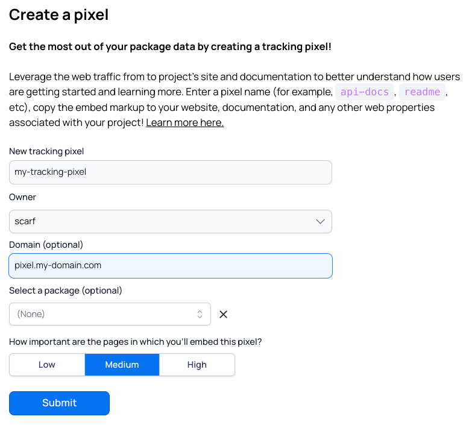

# Scarf Pixels

## How it works

Scarf gathers web traffic insights via a simple transparent, cookie-free, tracking pixel. You copy an `` tag from Scarf into your project's README, docs, website, or any other web property. Any time a user views content with your Scarf pixel, Scarf will look up any business metadata associated with the address and surface that information to you (and only you) via your Scarf account. Scarf does not store the IP address itself, so no personally identifiable information is retained.

Not relying on cookies has a some powerful effects:

- Scarf pixels don’t just work on your website / domain, but anywhere your content is viewed. You’re able to track visits to your documentation on 3rd party sites like your package registry provider, or when your docs are rendered locally on a user’s machine.
- No cookie banners are needed, and your users are never tracked from a Scarf pixel as they continue to surf the web.

## Creating a pixel

Head to your Scarf dashboard and click the + in the top-right corner, then click `New Pixel`. Give your pixel(s) a name, select an Owner to manage its scope (your organization is recommended), and optionally attach it to a package you manage on Scarf. This package attachment is optional and is solely used for visualizing the statistics for a pixel and a package together on the same page within the Scarf dashboard.


Pro Tip: All new pixels default to “Medium” importance. It’s a good idea to let Scarf start capturing data before determining if that needs to change.


By default, pixels are hosted in `static.scarf.sh`. You can use your own domain by filling in the domain field.



After creating the pixel with a custom domain, instructions will be provided on how to verify your domain.


The speed of domain verification will depend on how fast your DNS provider propagates the domain changes. When your domain is verified you should see this indicator.


Once created, you can access this Pixel in the Tools dropdown, under Pixels. Here, you will see a full list of all your existing Pixels.

### Tracking Pixel Custom Domains

Multiple domains can be added to a tracking pixels. In the same menu, tracking pixel domains can be removed.


## Embedding and using the pixel

Head to your Scarf dashboard and, in the Tools dropdown, select Pixels. Click Copy Pixel Snippet to copy the `` tag to your clipboard, and then paste the tag into your project's README, docs, and any other web properties where you want to gather insights into who is using your documentation pages.

### Where to place the pixel

Your pixel can go anywhere on the page, but generally adding it to commonly re-used components like the site header or footer works best. Higher up the page is better if possible.

**Important placement note (to avoid layout issues):**
- Do **not** place the raw `` pixel directly in visible nav/header markup where it can affect spacing.
- Do **not** place `` tags inside `<head>`.
- Prefer adding the pixel in a non-visual location (end of `<body>`, footer partial, or consent-aware analytics partial).
- If you embed the `` directly in page markup, render it in a layout-neutral way (for example, a 1x1 non-interactive element):

```html
"
  alt=""
  width="1"
  height="1"
  style="position:absolute; width:1px; height:1px; opacity:0; pointer-events:none;"
/>
```

It’s important that the pixel is re-rendered as visitors navigate your site and move to different pages. If your app is a single-page app (SPA), you’ll want to use the JS snippet in [Pixels and Single-Page-Application (SPA) sites](#pixels-and-single-page-application-spa-sites).

### Google Tag Manager (GTM)

Using Scarf pixels with Google Tag Manager works easily but requires one additional configuration step beyond simply dropping in your pixel URL.

| Field      | Value                                      | Example                                                    |
|------------|--------------------------------------------|------------------------------------------------------------|
| Tag Type   | Custom Image Tag                           | --                                                         |
| Image URL  | `<your Scarf pixel URL>&Page={{Page URL}}` | https://static.scarf.sh/a.png?x-pxid=123&Page={{Page URL}} |
| Triggering | Page View - All Pages                      | --                                                         |

This extra step is because GTM's injection of the pixel tends to tamper with the `referrer` header that Scarf relies on in order to infer what page is being loaded. We work around this by explicitly adding it to the URL's query parameters.

If for any reason, you need to use a different variable key besides `Page`, you'll want to configure a [custom variable override](https://app.scarf.sh/organizations/default/filters) for the `Page` parameter in your org settings, to whatever key you'd like to use. This ensures Scarf treats your parameter as the page rather than a normal arbitrary piece of data.


### Pixels and Single-Page-Application (SPA) sites

SPAs can sometimes be an initial challenge for a tracking pixel based approach if the pixel is not being re-loaded when user navigates to a new page. If your pixel is placed in your site's footer, for instance, it may not be re-loaded when a user navigates to a new page.

To ensure your pixel will be triggered on any page view within an SPA, there are two options:

1. If you have a standard template for each page's dynamic content, you can insert your pixel into that template, so it is re-rendered anytime the page changes
2. Use the following script (or similar) to dynamically load your pixel on page change:

```javascript
    (function () {
      const pixelID = '<your pixelID>';
      let lastHref = null;

      function sendScarfPing() {
        const currentHref = window.location.href;
        if (currentHref === lastHref) return;
        lastHref = currentHref;

        const url = `https://static.scarf.sh/a.png?x-pxid=${pixelID}`;
        const img = new Image();
        img.referrerPolicy = 'no-referrer-when-downgrade';
        img.src = url;
      }

      ['pushState', 'replaceState'].forEach(fn => {
        const original = history[fn];
        history[fn] = function () {
          original.apply(this, arguments);
          window.dispatchEvent(new Event('scarf:locationchange'));
        };
      });

      window.addEventListener('hashchange', sendScarfPing);
      window.addEventListener('popstate', sendScarfPing);
      window.addEventListener('scarf:locationchange', sendScarfPing);

      sendScarfPing(); // initial page load
    })();
```

## Caveats

### Obfuscation on GitHub

Scarf pixel tracking will work on standard web pages, rendered markdown documentation on package registry sites like Docker Hub, npm, and PyPI, and anywhere an image can be embedded, but a place with notably less visibility is GitHub. When GitHub renders markdown, it rewrites any image URLs from their original web address to `https://camo.githubusercontent.com/$`, where GitHub hosts any linked images themselves. This prevents Scarf from providing insights like company information to maintainers, since the end-user information is obfuscated from Scarf.

This prefetching also obscures the page being viewed on GitHub itself. One workaround is to add page information to your query parameter on each page you embed your pixel.

```html
<!-- explicitly send a `page` query parameter to Scarf to work around GitHub pre-caching -->

```

The above will send data to scarf with a specific `page` parameter.

## Learn more

Learn how to use Scarf Pixels for documentation insights in this [playbook](https://about.scarf.sh/post/track-your-projects-documentation-views).
